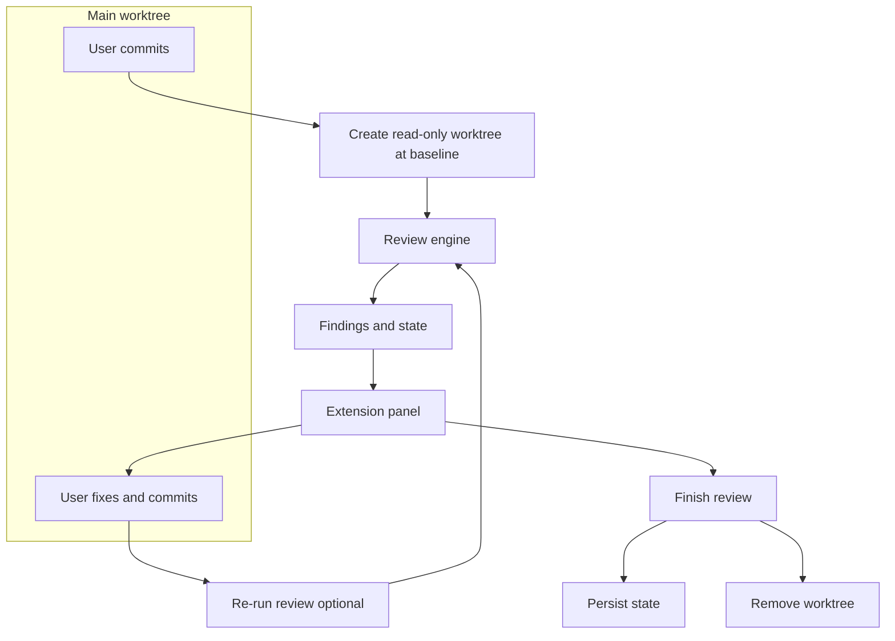

# Product Requirements Document: Local-First Code Review Tool

**Working title:** Stet (Local-First Code Review Tool)

**One-line summary:** A review-only, local LLM–powered code review tool that uses a read-only git worktree for stable scope, persists approved hunks to avoid flip-flopping, and surfaces findings in a Cursor/VSCode extension with a single "Finish review" action.

---

## 1. History and Motivation

### Context

The author had been using [RoboRev](https://github.com/roborev-dev/roborev) for code review but needed a different product shape.

### Needs

- **Local code review** with local LLMs (smaller models on a laptop); agentic coding was not a goal for this tool.
- **Review-only:** no fix or refine in this tool; those could be separate tools composed later.
- **Git-triggered review:** run when the user commits (or on explicit "Start review").
- **IDE integration:** Cursor/VSCode extension so findings are easy to use (jump to location, copy to chat).
- **PR-aware, incremental behavior:** only changed parts are re-reviewed; the tool must not flip-flop or resurface already-approved issues. Persistent "this hunk was already reviewed and approved" state.

### Friction with RoboRev

- RoboRev is focused on **multi-agent** review + fix + refine; its design is per-commit review without built-in persistent "approved hunk" state or worktree-based snapshot.
- Maintainer pushback on Ollama/local models (e.g. [PR 189](https://github.com/roborev-dev/roborev/pull/189)) and a different roadmap (multi-agent, cloud).

### Decision

Start a **new project** rather than fork or extend RoboRev, because scope and design differ fundamentally; a dedicated codebase keeps scope small and design coherent.

---

## 2. Goals and Non-Goals

### Goals

- **Excellent at one thing:** code review only (UNIX philosophy).
- **Local-first:** Ollama; target model qwen3-coder:30b, 32k context. Ollama server URL (host and port) is configurable; default is localhost; the server may run on another machine.
- **Persistent state:** approved hunks; no re-reviewing the same code.
- **Incremental review:** only new or changed hunks since baseline sent to the model.
- **IDE panel + "Finish review":** minimal extension surface; user stays in main worktree.
- **CLI:** for automation and headless use (start, run, finish, status, dismiss).
- **git-ai integration:** From v1, record completed review sessions so impact can be quantified (e.g. on "Finish review," attach a Git Note under a dedicated ref such as `refs/notes/stet` with session metadata for correlation with git-ai authorship data).
- **Actionable findings:** Findings should be actionable: the developer can apply the suggestion or fix the issue without reverting correct behavior. Dismissals and "not actionable" feedback are recorded and used (history, prompt shadowing, optimizer) to reduce false positives and improve future reviews.
- **Impact reporting:** `stet stats` for volume, quality, and cost/energy (implementation plan Phase 9).

The product targets a **32K token context window** as its design baseline so the tool runs reliably on typical development machines (e.g. MacBook Pro). The configurable context limit defaults to 32768; token budgeting and warnings are based on this target unless the user changes it.

### Non-Goals for v1

- Fix/refine in this tool (may be separate tools composed later, e.g. pipe review output to a fix tool).
- GitHub integration (per-PR state can come in a later phase).
- Multi-agent or cloud backends.
- Compatibility with RoboRev's output or workflows.

---

## 3. Design Decisions (from conversation)

| Decision | Choice |
|----------|--------|
| **Variant 2 workflow** | Worktree is a read-only snapshot of the baseline commit (read-only by convention: user and tool never edit it; Git does not enforce read-only). All editing stays in the main worktree. "Finish review" persists state and removes the worktree; no branch merge. |
| **User experience** | User keeps using the IDE as usual; the extension is used to view findings and to close the review. No need to work inside the review worktree. |
| **Hunk identity** | Content-based (e.g. file path + normalized content hash) so "approved" state survives small edits and only truly new/changed hunks are re-reviewed. |
| **State** | Minimal persisted state. Worktree is created from baseline when needed; "already reviewed" is derived from baseline + last_reviewed_at (ref). Only dismissals ("won't fix") are required persisted state; optional explicit per-hunk approval can be stored if supported. Locally, the "PR" is baseline plus follow-up commits; when connected to GitHub (later), state can be per-PR. |
| **Baseline** | For v1: Option C. Explicit `stet start [<ref>]`; default ref is current HEAD. Scope = baseline..HEAD; state is per-baseline. |
| **Extension surface** | Minimal: show list of findings (file, line, message, severity), jump to file:line, copy to chat, and a single "Finish review" button. |
| **Session end** | Explicit "Finish review" (button / `stet finish`). Alternative: tool treats review as done when 0 findings (see §9). |
| **UNIX philosophy** | This tool does review only; fix/refine can be separate tools composed later. |

---

## 3c. Derived state vs. persisted state

- **Worktree:** Read-only worktree is created from the baseline commit when needed (review start or re-run). Worktree path is not persisted; it can be session-local or derived (e.g. path keyed by baseline SHA). On "Finish review" the worktree is removed; a future review creates a new worktree from the current baseline.
- **"Already reviewed":** Derived from commits using **baseline** and **last_reviewed_at** (ref: commit at last review run). Hunks in scope at `last_reviewed_at` that have not changed are treated as already reviewed; only new or changed hunks since `last_reviewed_at` are sent to the model.
- **State Schema:**
    - **Session Path:** `.review/session.json` (or similar per-repo location).
    - **Fields:**
        - `baseline_ref` (string): e.g., "main" or commit SHA.
        - `last_reviewed_at` (string): Commit SHA of the head at the last successful review run.
        - `dismissed_ids` (array of strings): List of finding IDs marked as "won't fix".
        - `prompt_shadows` (array of objects): Optional. Stores `{"finding_id": "...", "prompt_context": "..."}` for future negative few-shotting.
- **State Portability:**
    - **Goal:** Personal productivity first, but team-compatible.
    - **Implementation:** Store state in `.review/` inside the repo. Users can `.gitignore` it for personal use or commit it to share baselines and dismissals with the team.

---

## 3d-p. Hunk identity algorithm (Dual-Pass)

To ensure stability across trivial edits (formatting, comments) while maintaining rigorous review, we use a **two-pass** identification strategy.

1.  **Pass 1: Strict Hash (The "Identity" Hash)**
    -   **Input:** Relative File Path + Raw Hunk Content (including context lines).
    -   **Normalization:** CRLF to LF.
    -   **Usage:** Used for exact cache hits. If a hunk matches this hash, it is **identical** to the previously reviewed version.
    -   **ID Format:** `SHA256(path + ":" + raw_content)`

2.  **Pass 2: Semantic Hash (The "Fuzzy" Hash)**
    -   **Input:** Relative File Path + Code-Only Content.
    -   **Normalization:**
        -   Strip all code comments (language-aware regex or Tree-sitter).
        -   Collapse all whitespace sequences to a single space.
        -   Trim leading/trailing whitespace.
    -   **Usage:** Used to detect **"moved" or "reformatted" code**. If the Strict Hash fails but the Semantic Hash matches a previously approved hunk, the system can:
        -   **Auto-approve** (if the policy allows).
        -   **Flag for "Format Review"** (cheaper prompt).
        -   **Retain "Dismissed" status** (e.g., if I dismissed a bug warning, and then just fixed a typo in the comment, I don't want the bug warning back).

---

## 3e. Cursor & IDE Integration

-   **Deep Linking:** usage of `cursor://file/...` or standard `file://` URIs allows findings to be clickable in the terminal and Markdown outputs.
-   **Chat Integration:** The extension (or CLI output) should provide a "Copy for Chat" block for each finding.
    -   **Format:**
        ```markdown
        [File:Line](file:///abs/path/to/file#L10)
        > [!WARNING] Potential Bug
        > The variable `x` is undefined here.
        
        ```
    -   **User Action:** User pastes this into Cursor Chat (Command+L). Cursor reads the file context via the URI and the LLM explanation, allowing for immediate "Fix this" prompts.

---

## 3f. Advanced Features (Shadowing, Streaming, Health)

-   **Prompt "Shadowing" (Learning from Dismissals):**
    -   When a user dismisses a finding (marks as "won't fix" or "false positive"), the tool stores the **Prompt + Hunk + Dismissal** tuple.
    -   **Future Usage:** These tuples can be injected as **negative few-shot examples** in future prompts for the same repo (e.g., "Do not flag this pattern: [code snippet]"). This effectively "fine-tunes" the prompt to the project's style without retraining the model.
-   **Streaming & Partial UI:**
    -   **CLI Output:** Supports NDJSON (Newline Delimited JSON) to emit findings as they are generated.
    -   **UX:** "Scanning `src/main.go`..." -> finding appears -> "Scanning `src/utils.go`..." -> finding appears.
    -   **Benefit:** Reduces perceived latency for local LLMs, which can be slow.
-   **Ollama Health Checks:**
    -   **Startup Check:** `stet doctor` or automatic check on start.
    -   **Verifies:** Ollama running? Model pulled? Model **runtime settings** (temperature, context size) are applied by Stet when calling the API (Stet passes them in each request; no requirement to configure these in the Modelfile).
    -   **Action:** Suggests `ollama pull <model>` (default qwen3-coder:30b; for lighter hardware, qwen2.5-coder:32b) or config fixes if the model is missing.
-   **Review actionability:** A finding is **actionable** if the reported issue is real (not already fixed or by design), the suggestion is correct and safe, and the change is within project scope. The system learns from dismissals and from explicit "not actionable" reasons (see history schema in implementation plan Phase 4.6) so that prompt shadowing and the DSPy optimizer can reduce non-actionable findings.

---

## 3g. RAG-Lite & Context Awareness

-   **Goal:** Provide "just enough" context for the LLM to understand dependencies without a full vector database (v1 limit).
-   **Implementation (v1.x):**
    -   **Symbol Lookup:** If a hunk modifies a function call `ProcessData(x)`, simple grep/ctags-style lookup finds the definition of `ProcessData` in the codebase.
    -   **Injection:** The definition signature (and docstring) is injected into the prompt alongside the hunk.
    -   **Limit:** Bounded to N symbols per hunk to fit context window.

---

## 3h. Review Quality Optimizer (DSPy)

To continuously improve review quality and reduce false positives without manual prompt engineering, Stet will include an **Optimizer** module powered by [DSPy](https://github.com/stanfordnlp/dspy).

-   **Goal:** Automatically tune the system prompt and few-shot examples based on the team's feedback (dismissals vs. approvals).
-   **Mechanism:**
    -   **Data Collection:** The tool silently accumulates a dataset of `(Diff, Review, UserAction)` tuples in `.review/history.jsonl`. The format is designed so that a future phase may support periodic upload or export of history for org-wide learning (architecture TBD).
    -   **Optimization Loop:** A sidecar process (run weekly or on-demand via `stet optimize`) uses DSPy to:
        1.  Load the history as a training set.
        2.  Define a metric: maximize acceptance rate, minimize dismissal rate.
        3.  Compile a new system prompt that effectively "learns" the project's specific style and tolerance for nits.
-   **Output:** Generates a `system_prompt_optimized.txt` which the main CLI loads if present, replacing the default prompt.
-   **Integration:** The core tool remains a static Go binary; the Optimizer is a Python script (or container) invoked optionally. This keeps the runtime lightweight while allowing for advanced AI capability.

---

## 4. User Flows

### IDE flow (Variant 2)

1. User commits in Git view (e.g. commit C1).
2. Review starts (extension or hook): create read-only worktree at C1, run review, store findings.
3. Extension panel shows findings in the same window; user jumps to locations `[file:line](file://...)`, copies to Cursor chat, fixes in main worktree, commits again (C2, C3, …).
4. Re-run review: same baseline (C1), only new/changed hunks (e.g. C1..HEAD) sent to model; approved hunks skipped.
5. User clicks "Finish review" in extension: state persisted, worktree removed.

### CLI flow

- **`stet doctor`**: Verify environment (Ollama, Git, models).
- **`stet start`** (or `stet start [<ref>]`): create worktree at baseline, run review, output findings (stdout/JSON).
- **`stet run`**: incremental re-review (baseline..HEAD), update findings and state.
- **`stet dismiss <id>`**, **`stet status`**: optional state interaction.
- **`stet finish`**: persist state, clean up worktree.

All commands run from repo root (main worktree); the user never needs to `cd` into the review worktree.

**Commit-first (v1):** v1 requires committed state for review. User runs `stet start [<ref>]` after committing. Uncommitted changes are out of scope; document as limitation. Optional later: review working tree (e.g. via stash or temporary commit).

### Edge cases

- **Empty diff (baseline..HEAD):** Exit 0 with "Nothing to review" or empty findings; do not call the model.
- **Binary / generated files:** Exclude from diff or skip; document behavior (e.g. list excluded paths in output).
- **.gitignore:** Respect .gitignore for diff scope (ignored files are out of scope unless overridden).
- **Baseline not ancestor of HEAD:** Error with clear message (e.g. "Baseline ref is not an ancestor of HEAD").
- **Uncommitted changes on `stet start`:** v1 is commit-first; error or warn and require clean state (or explicit override). Document.
- **Merge commits:** Scope is diff baseline..HEAD; document how merge commits are handled (e.g. combined diff or first parent).

---

## 5. Architecture Overview



- Commit in main worktree triggers (or user starts) review.
- Read-only worktree is created at baseline; review engine runs against it.
- Findings and state are produced; extension reads them and shows the panel.
- User fixes in main worktree; re-run review is incremental (same baseline, only new hunks).
- "Finish review" persists state and removes the worktree.

### Extension–CLI protocol

- **Invocation:** Extension spawns CLI; no long-lived daemon in v1.
- **Streaming mode:** CLI MAY emit **NDJSON** to stdout (one event per line): e.g. `{"type":"progress","msg":"..."}`, `{"type":"finding","data":{...}}`, `{"type":"session","data":{...}}`, `{"type":"done"}`. Enables progress and incremental findings.
- **Non-streaming:** Single JSON object to stdout on success (backward compatible).
- **Errors:** Structured error to stderr or defined exit code + message; exit 0 on success. On certain failures (e.g. uncommitted changes, worktree already exists), the CLI may output a one-line recovery hint to stderr (e.g. suggesting `stet finish` or commit/stash).
- **Exit codes:** Document (e.g. 0 = success, 1 = usage/error, 2 = Ollama unreachable).

---

## 6. Functional Requirements

| ID | Requirement | Notes |
|----|-------------|--------|
| FR-1 | Run code review using a local LLM via Ollama API | Target: qwen3-coder:30b, 32k context (default; configurable). The tool SHALL pass configurable model options (temperature, context window) to the Ollama API with documented defaults so the model runs with settings suitable for Stet's review behavior. Ollama server URL (host and port) configurable for local or remote server. |
| FR-2 | Create a read-only git worktree at a specified baseline (commit or branch) | Used only as input to the review engine; user never edits here |
| FR-3 | Persist review state: baseline ref, last_reviewed_at (ref), dismissals (e.g. finding IDs marked "won't fix"); optionally explicit approved hunk IDs if per-hunk approval is supported. "Already reviewed" for incremental runs is derived from baseline + last_reviewed_at; worktree is created from baseline when needed. | Survives re-runs and "Finish review" |
| FR-4 | Identify hunks in a stable way (Dual-Pass Hashing) so approved state survives small edits | Strict Hash + Semantic Hash (comments/whitespace stripped) |
| FR-5 | Incremental review: only new or changed hunks since baseline sent to model | Diff baseline..HEAD; skip approved hunks |
| FR-6 | CLI: start, run (incremental), finish, status, dismiss, doctor | All from repo root (main worktree) |
| FR-7 | Emit structured findings (e.g. JSON/NDJSON): file, line or range, severity, message, finding id | For extension and scripting |
| FR-8 | Extension: panel listing findings; jump to file:line; copy to chat; "Finish review" button | Minimal surface; no second window. Cursor deep links supported. |
| FR-9 | When `.cursor/rules/` or `AGENTS.md` exist, optionally discover applicable rules and inject as review constraints. | |
| FR-10 | Estimate prompt (and optional response) token count before calling the model; report to user in CLI and extension; warn when above configurable context threshold. | Avoids silent truncation; configurable context limit and warn ratio. |
| FR-11 | RAG-Lite Context: Inject definitions of symbols used in the hunk. | Simple lookup for v1 (grep/ctags). |
| FR-12 | Prompt Shadowing: Save dismissed findings as negative examples for future prompts. | |

---

## 7. Non-Functional Requirements

- **State storage:** Stored: baseline ref, last_reviewed_at ref, dismissals (IDs user marked "won't fix"); optionally explicit per-hunk approvals. Worktree path and "already reviewed" set are derived (worktree from baseline; already-reviewed from baseline + last_reviewed_at), not stored. State lives in a documented location (e.g. out-of-repo `~/.local/share/stet/` keyed by repo/branch, or in-repo `.review/`). Exact path and schema at implementation time; document in a "State storage" subsection.
- **Optimizer history:** `.review/history.jsonl` holds (Diff, Review, UserAction) tuples for the DSPy optimizer. Stored locally in v1; schema is designed for future periodic export/upload for org-wide learning (see §3h, §9).
- **State storage tradeoffs:** In-repo `.review/`: portable, visible in git status; may need .gitignore. Out-of-repo (e.g. `~/.local/share/stet/` keyed by repo): no repo pollution. Recommend one for v1 and document. Optional state file schema example: e.g. JSON or TOML with `baseline`, `last_reviewed_at`, `dismissals` (array of finding IDs).
- **No daemon:** Basic flow works without a long-running daemon; CLI and extension invoke the same review binary/script.
- **Single active review:** One active review session per repo/branch (or per baseline); "Finish" clears it.
- **Concurrency:** Only one active review per repo (or per baseline). If `stet start` runs while a review is active, fail with a clear message (e.g. "Finish or cleanup current review first"). Use a lock (e.g. in state dir or repo) so CLI and extension do not run review concurrently; document lock location and cleanup.

### Configuration

- **Hierarchy:** CLI flags > environment variables > repo config > global config > defaults.
- **Paths:** Repo: `.review/config.toml` (or `.review/config.yaml`); global: `~/.config/stet/config.toml` (or XDG equivalent).
- **Keys:** model, ollama_base_url, context_limit, warn_threshold, timeout, token_estimation (optional), state_dir (optional), worktree_root (optional). Config SHALL support **model runtime settings** for Ollama so Stet runs the model with settings appropriate for code review: at minimum **temperature** (default: low, e.g. 0.2) and **context window for the model** (e.g. num_ctx; default aligned with context_limit 32768). Stet may use the model's reported context size (from Ollama `/api/show`) when it is larger than the configured value, so that backends with larger context work without user configuration. Other options (e.g. top_p) may be added. These are passed to the Ollama API (e.g. /api/generate options) so the model runs with the correct settings regardless of server/Modelfile defaults. Per-repo prompt: `.review/prompt.md` (path and how it overrides/merges with defaults). **ollama_base_url:** Base URL of the Ollama API (hostname or IP and port). Default: `http://localhost:11434`. The server may run on the same machine or on another machine (e.g. `http://192.168.1.10:11434` or `http://ollama.example.com:11434`).
- **Format:** TOML preferred for Go; document schema and one example.

### Error handling and failure modes

| Scenario | Expected behavior | User-facing message |
|----------|-------------------|---------------------|
| Ollama unreachable | Fail with clear error | Check Ollama server URL (config ollama_base_url), ensure the server is running and reachable; for local server suggest `ollama serve`. The CLI MUST also output the underlying error (e.g. connection refused, context canceled, timeout) to stderr for troubleshooting. |
| Model not found | Fail with clear error | Suggest `ollama pull <model>` |
| Malformed JSON from model | Retry once, then fail or best-effort + warning | Clear message; optional fallback |
| Timeout | Configurable; surface in UI | Timeout exceeded |
| Git errors (unclean worktree, missing ref) | Fail with clear error | Describe the Git condition |
| Worktree already exists | Explain; offer cleanup or `stet finish` | Clear message |
| Orphan worktrees | Offer `stet cleanup` | Document behavior |

- **git-ai integration:** On "Finish review," write review session metadata to a Git Note (e.g. ref `refs/notes/stet`) attached to current HEAD: e.g. session_id, baseline_sha, head_sha, findings_count, dismissals_count, tool_version, finished_at. Document note schema and refspec so users can push/fetch Stet notes alongside git-ai's `refs/notes/ai` for impact analytics.

---

## 8. Output Format (contract for extension)

### Findings

Array of objects with at least:

- `id`: stable identifier generated by the tool (e.g. hash of file + range + normalized message stem); used for dedup and dismissals. Model output is not the source of truth for IDs.
- `file`: path relative to repo root.
- `line` or `range`: line number or `{ "start", "end" }`.
- `severity` (required): one of `error | warning | info | nitpick`. The prompt must request this from the model.
- `category` (required): one of `bug | security | performance | style | maintainability | testing | documentation | design`. For extension filtering; aligns with prompt strategies (§3d).
- `message`: review comment text.
- `suggestion` (optional): patch or snippet.
- `cursor_uri`: `file:///path/to/file#L10` for deep linking.

### Session (for extension and "Finish review")

- `baseline`: ref used as baseline (stored).
- `worktree_path`: path to the read-only worktree; **derived** when a worktree is created (at start or re-run); used by extension/tool to remove it on finish. Not durable persisted state.
- `findings`: array as above.
- `approved_ids` / "already reviewed": **derived** from baseline + last_reviewed_at for incremental behavior; only **dismissals** (and optionally explicit approved IDs) are persisted. The session contract can still expose approved_ids or already_reviewed as a computed view for the UI.

---

## 9. Open Questions / Later Phases

- **Exact state storage path and format:** in-repo vs out-of-repo; schema for baseline, last_reviewed_at, dismissals; optionally explicit approved hunk/finding IDs. Not for worktree_path or full approved set (those are derived).
- **Trigger:** Review on every commit (post-commit hook) vs explicit "Start review" (extension or CLI). If hook: post-commit hook can notify the extension (e.g. via file or side-effect) so the extension offers "Start review for this commit." If extension-driven: extension can wrap or follow the Commit action so it runs "commit then start review." Hook is more UNIX; extension wrap keeps flow in-IDE.
- **Session end:** Keep explicit "Finish review" (user clicks or `stet finish`) vs. **tool knows review is done** when the LLM returns zero findings—then auto-persist state, remove worktree, and write the git note. Tradeoff: explicit Finish gives the user control over when `last_reviewed_at` is set and when the worktree is removed; auto-finish when 0 findings simplifies UX. Optional: retain an explicit "Finish anyway" for closing the session with open findings.
- **Naming (resolved):** **Project and CLI name: Stet.** Used consistently in code, configs, and documentation. See "About the name Stet" below.
- **License:** If copying or adapting RoboRev code or structure, respect its license. If starting fresh and reusing only ideas, use a permissive license (e.g. MIT) for the extension and future composition with other tools.
- **GitHub:** per-PR state and optional CI integration in a future phase.
- **Org-wide shared learning (future):** Allow the system to learn from all users in an org/corporation. Reviews could be uploaded or added periodically by users (not necessarily real-time). Target something lighter than a shared PostgreSQL DB (e.g. periodic push to an endpoint, or export/import of history). Architecture and transport TBD in a later phase. Local `.review/history.jsonl` and optimizer remain the v1 design; this is a future extension.

### About the name Stet

- **Origin:** "Stet" is a Latin word used in proofreading and editing (from *stare*, "to stand").
- **Meaning:** It means "let it stand" — an instruction to keep existing text unchanged, i.e. to approve it as-is.
- **Why it's used:** The tool is review-only and focuses on approving or flagging code; "stet" fits that approve/let-stand metaphor. The name is short, distinctive, and works well for a CLI (e.g. `stet start`, `stet finish`) and for documentation.

---

## 10. Glossary

- **baseline** — The commit (or ref) from which the review scope starts; scope is baseline..HEAD.
- **hunk** — One git diff block (`@@ ... @@`); unit of content-based identity for "already reviewed."
- **finding** — A single review comment (file, line/range, severity, category, message, optional suggestion) with a stable tool-generated ID.
- **dismissal** — A finding the user marked "won't fix"; persisted by finding ID.
- **session** — One review run (baseline, worktree, findings, state); one active session per repo/baseline.
- **worktree** — A read-only checkout of the baseline commit used for diff and context.
- **last_reviewed_at** — Commit SHA at which the last review run completed; used to derive "already reviewed" hunks.
- **shadowing** — The process of saving prompt/diff pairs of dismissed findings to prevent recurrence in future runs.

---

## 11. References

- Conversation summary (this chat); design choices captured in this PRD. Prompt strategies (§3d) and the 10 concrete ideas (scoped prompts, few-shot, rule-augmented, etc.) were researched and decided in that conversation.
- [RoboRev](https://github.com/roborev-dev/roborev) — conceptual contrast; no dependency. Do not reuse its prompts verbatim; design for local + 32k per §3d.
- [CursorRules](https://github.com/beettlle/CursorRules) — optional integration for review criteria when present in repo.
- [Ollama API](https://github.com/ollama/ollama/blob/main/docs/api.md) — local LLM.
- [Ollama structured outputs](https://docs.ollama.com/capabilities/structured-outputs) — JSON schema for findings.
- Git worktree documentation — `git worktree add`, lifecycle.
- Target model: qwen3-coder:30b, 32k context.

---

## 12. Implementation notes

Recommendation from conversation: implement the CLI in **Go** (single binary, no runtime, RoboRev as reference, go-git or exec git, fast iteration). **Rust** is a viable alternative (portability, strong typing); tradeoffs include compile time and less direct "review tool" ecosystem. The extension remains TypeScript/JavaScript; it can invoke the CLI via stdout (JSON) or a small protocol.

- **Directory structure:** Monorepo: `cli/` (Go: cmd, internal/review, internal/git, internal/llm, internal/state, internal/config), `extension/` (TypeScript), `docs/`. Single root `go.mod`. Findings schema defined once (e.g. in cli); export for extension (JSON Schema or generated types).
- **Phased order:** (1) CLI: config, state, worktree create/cleanup; (2) Diff: hunk ID, "already reviewed"; (3) Ollama: prompts, token estimation, structured output; (4) CLI commands: start, run, finish, status; (5) Extension: panel, jump, copy-to-chat, Finish.
- **Dependencies:** Go: go-git (or exec git), Ollama client, Cobra, tokenizer (e.g. Qwen) if used. Extension: TypeScript, VS Code API.
- **Schema as code:** Define findings schema in one place; derive Ollama `format` schema and extension types from it.

---

## 13. Testing

- **Unit:** Hunk ID algorithm (Dual-Pass), normalization, token estimation, state load/save, finding ID generation.
- **Integration:** Worktree lifecycle (create, review, finish, crash recovery); CLI commands; JSON/NDJSON contract; mock Ollama or canned responses.
- **Extension:** VS Code test runner for panel, diagnostics, Finish action.
- **Fixtures:** Small repos with known diffs and expected finding shape for regression.
- **`--dry-run`:** CLI flag that skips LLM call and uses canned response; document for fast CI and iteration.