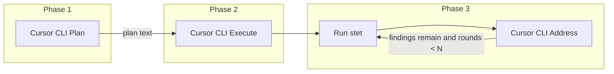

# Product Requirements Document: Cursor CLI Orchestrator

**Working title:** Cursor CLI Orchestrator

**One-line summary:** A standalone orchestrator that drives the Cursor CLI in three phases per task (plan, execute, stet+address) via separate invocations to avoid context exhaustion; it consumes a markdown feature plan and runs on all platforms Cursor supports.

**Relationship to Stet:** This is a **separate application** from Stet. It is not part of the stet codebase or shipped with stet. The PRD lives in the stet repo's `docs/` for specification and versioning only. **Stet is optional:** if stet is found on the system (e.g. on PATH in the target repo), the orchestrator SHALL use it for phase 3 (run stet and address findings). Stet is not a requirement; if stet is not found or not configured, the orchestrator SHALL still run (phases 1 and 2, and phase 3 stet steps are skipped).

---

## 1. History and Motivation

### Context

The user workflow is: (1) an Ask-mode conversation in Cursor to define a feature at a very specific level; (2) the LLM produces a markdown file listing small, testable tasks; (3) for each task, the user runs a per-task loop: create a plan for the task, execute that plan, run stet and address any findings—using a **new context window per task** to preserve context; (4) after all tasks, a final stet review and brutal audit. The user relies heavily on Cursor's @-commands when developing each task.

### Need

Automate this loop with an **orchestrator/scheduler** that shells out to the Cursor CLI and to stet, passing data between phases (plan text, stet output) so that the same workflow can run with minimal manual steps and with no ambiguity for an engineering team implementing the tool.

### Decision

Build a **separate Rust application**. The three phases per task (create plan, execute plan, run stet and address issues) are mapped to **separate CLI invocations** so the context window is never exhausted by combining plan, execute, and stet in one conversation thread.

---

## 2. Goals and Non-Goals

### Goals

1. **Run on all platforms Cursor supports:** Windows (native), macOS (x64 and ARM64 where Cursor supports them), Linux (x64; WSL where applicable). Single binary per platform.
2. **Three-phase per-task flow:** Create plan → Execute plan → Run stet and address issues (when stet is available). Each phase that involves the Cursor CLI SHALL use its own CLI invocation (new process). Phase 3 runs only when stet is found on the system; it involves the orchestrator running stet, then one or more Cursor CLI calls with findings. When stet is not available, phase 3 is skipped and the orchestrator proceeds to the next task after phase 2.
3. **Consume a single feature plan file:** The orchestrator reads one markdown file (path configurable or passed as argument) and iterates over discrete tasks in a canonical format (§5).
4. **Resume after failure:** Persist state (plan path, repo path, completed task indices) so the run can resume from the next task after a crash or stop.
5. **Single binary; no runtime dependency:** The orchestrator SHALL be distributable as one static (or mostly static) binary per platform. It SHALL NOT require Python or Node at runtime.
6. **Use Cursor's Auto model by default:** The orchestrator SHALL omit `--model` (or use `--model auto` if the Cursor CLI documents it) so Cursor selects the model. An optional config override SHALL allow a specific model (e.g. `--model "gpt-5.2"`).
7. **Security:** The orchestrator SHALL invoke the Cursor CLI **without** a shell (exec-style). Prompt construction SHALL be explicit and centralized to reduce prompt-injection and memory-safety risks (§11).

### Non-Goals for v1

- **Not part of Stet:** The orchestrator is not in the stet codebase and is not shipped with stet.
- **No LLM implementation:** The orchestrator only invokes the Cursor CLI (and stet when available); it does not call any LLM API directly.
- **No Cloud Agent requirement:** Support for Cursor's Cloud Agent (`-c` / `--cloud`) is out of scope unless specified in a later revision.

---

## 3. Design Decisions

| Decision | Choice |
| -------- | ------ |
| **Phases per task** | Exactly three: (1) Create plan, (2) Execute plan, (3) Run stet and address issues. Phases 1 and 2 are Cursor CLI calls; phase 3 is orchestrator runs stet, then one or more Cursor CLI calls with findings. |
| **Context preservation** | Each phase uses a **separate** Cursor CLI invocation (new process); no shared conversation across phases. |
| **Plan phase** | Cursor CLI run with **Plan mode** (`--mode=plan` or `--plan` per [Cursor CLI docs](https://cursor.com/docs/cli/overview)). |
| **Execute phase** | Cursor CLI run in default Agent mode; prompt includes the plan produced in phase 1 (passed by orchestrator). |
| **Stet + address** | When stet is found on the system, the orchestrator SHALL use it: run stet (exact sequence in §9), capture stdout/stderr, and pass it into the next Cursor CLI prompt ("Address these stet findings: …"). May loop until no findings or a configurable max rounds. When stet is not found, phase 3 stet steps are skipped; not a requirement. |
| **Language** | Rust. Rationale: memory safety, no shell for subprocess (e.g. `std::process::Command` with `.arg()` only), cross-platform, single binary. |
| **Command name for Cursor** | Configurable (e.g. `agent` or `cursor-agent`); default SHALL be documented (e.g. `agent` per Cursor install). Resolved from PATH. |

---

## 4. Plan File Format (Canonical)

### Source

The "feature plan" is a single markdown file. Its path is configurable or passed as an argument. It is produced **outside** the orchestrator (e.g. by the user with Cursor in Ask mode).

### Task boundaries (v1 only)

For v1, the orchestrator SHALL support **exactly one** format so parsing is unambiguous.

- **Format:** Tasks are second-level headings: `## Task 1`, `## Task 2`, … (digit sequence). Task content is everything from the end of that heading line until the next line that matches a task heading or EOF.
- **Parsing rule:** A task heading SHALL match the pattern `^## Task\s+(\d+)\s*$` (after stripping CRLF to LF). The capturing group is the task index. Task body = lines after the heading until the next line matching `^## Task\s+\d+` or end of file. Tasks SHALL be ordered by ascending index (1, 2, 3, …). Gaps (e.g. Task 1, Task 3) are allowed but the orchestrator SHALL process in numerical order.
- **Encoding:** Plan file SHALL be UTF-8. Invalid UTF-8 SHALL cause "Invalid or missing plan file" before any task runs.

---

## 5. Per-Task Flow (Sequence)

The following sequence SHALL be implemented without reordering; ambiguity is resolved by this section.

1. **Phase 1 — Create plan**
   - Orchestrator invokes Cursor CLI once with: configurable `agent_cmd`, `--mode=plan` (or `--plan` per Cursor CLI docs), `-p "Create a plan for implementing this task: {task_content}"`. No `--model` (Auto). Working directory = target repo root.
   - Orchestrator SHALL capture stdout (and optionally stderr) as the **plan text**. If the Cursor CLI writes the plan to a file instead of stdout, the PRD defers to the actual CLI behavior: the orchestrator SHALL read the plan from the documented output (stdout or a documented file path).
   - Timeout: configurable; on timeout SHALL fail the task, persist state, exit non-zero. Non-zero exit from the CLI: SHALL be configurable (retry once vs. fail task); default SHALL be fail task and persist state.

2. **Phase 2 — Execute plan**
   - Orchestrator invokes Cursor CLI once: `{agent_cmd} -p "Execute the following plan. Do not re-plan; only implement and test.\n\n{plan_text}"`. Agent mode (default). No `--model` unless overridden. Working directory = target repo root. If the agent must run git/stet, sandbox SHALL be disabled via config (e.g. `--sandbox disabled`); see §8.
   - Orchestrator SHALL capture stdout/stderr for logging; there is no requirement to parse code from output (the agent edits files on disk).
   - Timeout and non-zero exit: same policy as phase 1 (configurable; default fail task, persist state).

3. **Phase 3 — Stet and address (when stet is available)**
   - If stet is **not** found on the system (or not configured), the orchestrator SHALL skip phase 3 (3a–3c) and proceed to the next task. Stet is not a requirement.
   - **3a.** When stet is available: orchestrator runs the **stet command sequence** (§9) in the **target repository** (working directory = repo root). Orchestrator SHALL capture full stdout and stderr.
   - **3b.** If there are findings (§9): orchestrator invokes Cursor CLI with `{agent_cmd} -p "Address the following stet review findings. Apply fixes and run tests.\n\n{stet_output}"`. Optional: `--output-format text` for parseable output. Working directory = repo root. Orchestrator SHALL capture stdout/stderr.
   - **3c.** After the agent run, orchestrator MAY re-run the stet command sequence. If findings remain and round count &lt; N (configurable `max_address_rounds`), repeat 3b–3c; else proceed: SHALL either fail the task (configurable) or mark task as "has remaining findings" and continue to next task (configurable). Default SHALL be documented (e.g. warn and continue).

---

## 6. Per-Task Flow (Diagram)

- Plan phase produces plan text; execute phase consumes it. Execute phase edits repo. When stet is available, stet runs in repo and address phase consumes stet output; phase 3 loop is until no findings or max rounds. When stet is not available, phase 3 is skipped.

---

## 7. User Flows (High-Level)

### Flow 1 — Full run

User provides path to feature plan markdown and path to target repo (via config or CLI). Orchestrator parses tasks (§4), then for each task runs phases 1 → 2 → 3 (with 3b–3c loop as in §5). After all tasks: optional "final stet review" and "final brutal audit" (orchestrator runs user-configured commands, captures output; no Cursor call). See FR-9.

### Flow 2 — Resume

After crash or stop, user runs orchestrator with "resume" (and same plan path / repo path). Orchestrator loads persisted state (§10), skips tasks whose index is in the completed list, continues from the next task.

### Flow 3 — Single task

User MAY request "run only task N" (e.g. for debugging). Orchestrator runs phases 1–3 for that task only. State MAY be updated (e.g. completed list) so resume behavior is consistent.

---

## 8. Cursor CLI Contract

- **Reference:** [Cursor CLI Overview](https://cursor.com/docs/cli/overview).
- **Invocation:** Non-interactive only. The orchestrator SHALL use `-p "..."` for the prompt. No interactive approval; suitable for scripts/automation.
- **Command:** Configurable binary name (e.g. `agent` or `cursor-agent`). Default SHALL be `agent` (per Cursor install docs). Resolved from PATH. The orchestrator SHALL invoke the binary **without** a shell (exec-style; see §11).
- **Modes:** Phase 1: `--mode=plan` or `--plan` (per Cursor CLI docs). Phases 2 and 3: default mode (Agent). Implementers SHALL verify exact flag names from the current Cursor CLI documentation.
- **Model:** Omit `--model` to use Auto. Optional config key (e.g. `model`) SHALL allow override (e.g. `"gpt-5.2"`).
- **Output:** For phases where the orchestrator must capture the reply (plan text in phase 1; optional address summary in phase 3), the orchestrator SHALL capture stdout and MAY capture stderr. Use of `--output-format text` (if supported) is RECOMMENDED for parseable output.
- **Sandbox:** When the agent must run git or stet, sandbox SHALL be disabled. Configurable (e.g. `--sandbox disabled` or equivalent per Cursor CLI docs). Default for execute and address phases SHALL be documented (e.g. disabled when repo_path is set).
- **Working directory:** All Cursor CLI invocations SHALL run with current working directory set to the **target repository root** so the agent sees the repo.

---

## 9. Stet Integration Contract

### Optional use

**Stet is not a requirement.** If stet is found on the system (e.g. `stet` on PATH when the orchestrator runs in or against the target repo), the orchestrator SHALL use it for phase 3 as described in this section. If stet is not found or not configured, the orchestrator SHALL skip phase 3 stet steps and continue to the next task after phase 2; the run SHALL still succeed.

### Scope (when stet is used)

When stet is available, the orchestrator runs stet **in the target repository** (the repo being developed). The orchestrator only shells out to the stet CLI; it does not link to stet or implement review logic. Stet commands and dismiss reasons are documented in the project's [.cursor/rules/stet-integration.mdc](.cursor/rules/stet-integration.mdc).

### Exact command sequence

- **"Run stet"** means: working directory = target repo root; then run the configured sequence. For v1 the minimal sequence SHALL be:
  1. `stet start [ref]` — Start review from baseline. The ref (e.g. `HEAD~1` or a branch) SHALL be configurable; default MAY be current `HEAD` or user-configured.
  2. `stet run` — Re-run incremental review and produce findings.
- Alternatively, the orchestrator MAY support a single **wrapper command** (e.g. a script or `stet start && stet run`) if the user's workflow is one command; the config key (e.g. `stet_commands` or `stet_run_script`) SHALL be defined so that either a list of commands or one wrapper can be specified.
- **After "address findings":** To re-check, the orchestrator runs `stet run` again (no new `stet start` unless the session was finished). If the user's workflow uses `stet finish` between tasks, that SHALL be configurable (e.g. "after each task" vs. "once at end").

### Capture and "findings present"

- Orchestrator SHALL capture stdout and stderr of every stet invocation.
- **Findings present:** If stet supports machine-readable output (e.g. JSON or NDJSON), the orchestrator SHOULD use that to decide "findings present" (e.g. non-empty findings array). Otherwise, the orchestrator SHALL use a documented heuristic: e.g. "findings present if stet exit code != 0" or "findings present if stdout contains at least one finding block" (format to be defined from stet's actual output). This removes ambiguity for when to run the "address findings" Cursor CLI call.

---

## 10. State and Resume

### Persisted state (minimal)

1. **Plan path** (string) and **target repo path** (string).
2. **Completed task indices** (list of integers) — tasks already fully processed.
3. **Optional:** Last produced "plan text" per task (for re-running phase 2 without phase 1); optional for v1.
4. **Optional:** Commit or ref corresponding to last completed task (for final review reporting).

### Where stored

Configurable directory (e.g. `~/.config/cursor-orchestrator/` or a path relative to plan file). Single state file per run or per (plan path + repo path) pair. Format: TOML or JSON. Schema SHALL include at least: `plan_path` (string), `repo_path` (string), `completed_task_indices` (array of integers). Optional fields: `last_plan_by_task` (map or array), `last_completed_ref` (string).

### Resume semantics

On startup with "resume," orchestrator SHALL load state, skip tasks whose index is in `completed_task_indices`, and start from the smallest task index not in that set. If state file is missing or corrupted, orchestrator SHALL treat as "no resume": start from task 1 and SHALL warn the user (e.g. to stderr).

---

## 11. Security and Prompt Injection

### Subprocess

The orchestrator MUST use process execution **without** a shell. Arguments (prompt, flags) SHALL be passed as separate arguments (e.g. `Command::new(agent_cmd).arg("--mode=plan").arg("-p").arg(prompt).current_dir(repo_root)`). The orchestrator SHALL NOT build a single string and pass it to `sh -c`, `cmd /c`, or any shell.

### Prompt construction

All user- or external-facing content (task text, plan text, stet output) SHALL be passed as separate arguments or via a temp file with UTF-8 encoding. The orchestrator SHOULD treat task/plan/findings as untrusted: use delimiters in the prompt (e.g. "Execute only the following plan between the tags") so the model is less likely to follow instructions embedded in that content. A single, well-defined place in the implementation SHALL be responsible for building prompts (no scattered string concatenation). Full "injection-proof" encoding is not required for v1, but the risk SHALL be documented and the construction point SHALL be explicit.

### Memory safety

Rust is required. Subprocess output SHALL be read into standard types (e.g. `String`, `Vec<u8>`) with bounded reads as needed; no manual buffer handling that could expose overflow or use-after-free.

---

## 12. Functional Requirements

| ID | Requirement |
| -- | ----------- |
| FR-1 | Parse the feature plan file according to the canonical task format (§4) and produce an ordered list of (task_index, task_content). |
| FR-2 | For each task, run phase 1 (Cursor CLI in Plan mode) and capture the plan text. |
| FR-3 | For each task, run phase 2 (Cursor CLI in Agent mode) with the plan text in the prompt; CWD = repo root. |
| FR-4 | When stet is available: run the configured stet command sequence in the repo after phase 2 and after each "address findings" round; capture stdout/stderr. When stet is not found, skip these steps. |
| FR-5 | When stet is available: run phase 3 Cursor CLI call(s) with stet output in the prompt; support configurable max rounds for "address findings." When stet is not found, skip phase 3. |
| FR-6 | Persist state (plan path, repo path, completed task indices; optional last-plan and ref) and support resume. |
| FR-7 | Support "run only task N" and "run from task N to end" (configurable or CLI flags). |
| FR-8 | Configurable: agent command name, repo path, plan path, stet command sequence, sandbox, model override, timeouts, max address rounds. |
| FR-9 | Optional post-run: run user-configured "final stet review" and "final brutal audit" commands; capture and report output (no Cursor call). |

---

## 13. Non-Functional Requirements

- **Platforms:** Windows (native), macOS (x64 and ARM64 where Cursor supports), Linux (x64; WSL if Cursor supports). Build via Rust target triples; supported triples SHALL be documented (e.g. `x86_64-pc-windows-msvc`, `x86_64-apple-darwin`, `aarch64-apple-darwin`, `x86_64-unknown-linux-gnu`).
- **Distribution:** Single static (or mostly static) binary per platform. No runtime dependency on Python or Node for the orchestrator.
- **Configuration:** File (e.g. TOML or YAML) and/or environment variables and/or CLI flags. Precedence SHALL be defined (e.g. CLI &gt; env &gt; config file). Config keys SHALL include at least: `agent_cmd`, `plan_path`, `repo_path`, `stet_commands` (or equivalent), `sandbox`, `model`, `max_address_rounds`, `state_dir`, `phase_timeout_sec` (or equivalent).
- **Logging:** Structured logging (e.g. phase, task index, command run, exit code, duration) to stderr or a configurable log file. Logs SHALL NOT contain secrets (e.g. full prompt text MAY be truncated or omitted).

---

## 14. Edge Cases and Error Handling

| Case | Behavior |
| ---- | -------- |
| **Cursor CLI not found** | Check PATH before first use; exit with clear message and link to [Cursor CLI install](https://cursor.com/docs/cli/overview). |
| **Stet not found** | Not an error. Orchestrator SHALL skip phase 3 (stet and address) and proceed to the next task. Stet is optional. |
| **Stet fails (when used)** | Configurable: fail the current task (default), or retry once, or continue with "stet phase skipped." Default SHALL be fail current task and persist state. |
| **Plan file missing or unparseable** | Exit before starting any task; message "Invalid or missing plan file." |
| **Task N phase 1 or 2 times out** | Configurable timeout; on timeout SHALL fail task, persist state, exit non-zero. Retry (e.g. once) MAY be configurable; default no retry. |
| **No findings from stet** | Phase 3b (address findings) SHALL be skipped; proceed to next task. |
| **Repo path not a git repo** | Fail fast with clear message (e.g. "Target path is not a git repository"). |

---

## 15. Out of Scope for v1

- Implementing the Cursor CLI or stet; only invoking them.
- Editing the plan file or generating the feature plan (user produces it via Cursor Ask mode).
- Cloud Agent integration unless explicitly added later.
- Web UI or IDE plugin; CLI-only orchestrator.
