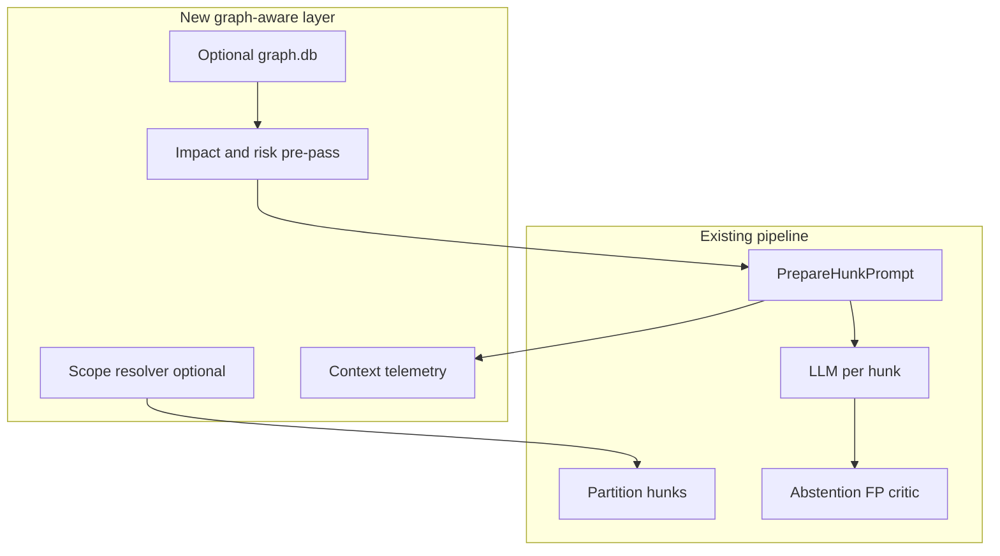
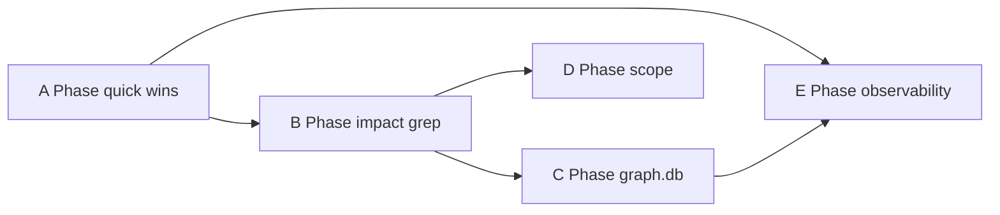

# Graph-aware review — engineering implementation spec

> **Status:** Engineering handoff spec (June 2026). Derived from [pi-code-review-graph-research.md](pi-code-review-graph-research.md). Intended for engineering to decompose into tickets and an implementation plan. **No timelines or effort estimates** — scheduling is engineering's responsibility.

**Read first:** [PRD.md](PRD.md), [roadmap.md](roadmap.md) §10, [implementation-plan.md](implementation-plan.md), [review-process-internals.md](review-process-internals.md), [cli-extension-contract.md](cli-extension-contract.md).

---

## Summary

| Phase | Focus | Persistent graph required |
|-------|-------|-------------------------|
| **A** | Quick wins: telemetry, secret guards, confidence labels, extension live review, readiness score | No |
| **B** | Impact and risk enrichment; cross-file findings (roadmap §10.1) | No (grep/AST) |
| **C** | Optional `.review/graph.db` SQLite index | Yes |
| **D** | CLI scope modes (unstaged / staged / branch) | No |
| **E** | Observability JSONL; MCP tool interfaces (future) | Optional |

All paths in **Primary files** are relative to `cli/internal/` unless noted.

---

## Guiding principles

1. **Keep the hunk pipeline** — Graph and impact context are enrichment and ordering, not a single mega-prompt replacement.
2. **Default off** — Every new behavior behind config flags; defaults preserve current behavior.
3. **Graceful degradation** — Missing, stale, or partial graph/index must not block review; fall back to hunk-only + grep/AST.
4. **Label heuristic context** — Prefix RAG/call-graph/impact blocks with confidence (`ast` vs `heuristic`); never treat grep edges as ground truth.
5. **Single Go binary** — Prefer `go/ast`, `git grep`, and optional `database/sql` + SQLite; do not add Bun/Node to the CLI critical path.

### Architecture target



### Explicit non-goals (all phases)

- Porting pi-code-review-graph as a Pi/npm extension
- Auto-injecting graph context on every Cursor agent coding turn
- Mandatory full-repo graph index on every review run
- Replacing abstention, FP kill list, or critic with graph-only review
- Duplicating [tirth8205/code-review-graph](https://github.com/tirth8205/code-review-graph) MCP wholesale
- Blocking review when graph is stale or build fails

---

## Phase A — Quick wins (no persistent graph)

### A1 — Token and context telemetry

**Goal:** Measure how much context enrichment adds per hunk and per run; support tuning `context_limit` and RAG caps (CRG `tokenSavings` pattern).

**Entry points:**

- `review/review.go` — `PrepareHunkPrompt` (or wrapper) records char/token counts after each enrichment stage
- `run/run.go` — aggregate run totals; emit on finish / git note
- `stats/` — extend existing stats helpers (`volume.go`, `quality.go`) or add `stats/context.go`

**Config keys:** None required initially; always collected when `--trace` is set. Optional future: `context_telemetry_enabled` in config.

**Data structures:**

```go
// stats/context.go (proposed)
type HunkContextMetrics struct {
    File              string
    BaselineChars     int   // hunk-only user prompt
    EnrichedChars     int   // final user prompt
    ExpandChars       int
    RAGChars          int
    CallGraphChars    int
    RulesChars        int
    IntentChars       int
}

type RunContextMetrics struct {
    Hunks             []HunkContextMetrics
    TotalBaseline     int
    TotalEnriched     int
    SavingsPercent    float64 // (TotalEnriched - baselineFileBytes) / baselineFileBytes if applicable
}
```

**Pipeline integration:** After `PrepareHunkPrompt` returns, if `opts.TraceOut != nil`, write one line per hunk with metrics. On `stet finish`, optional fields in git note JSON (align with Phase 9 in [implementation-plan.md](implementation-plan.md)).

**Extension contract:** No change required for Phase A1.

**Tests:**

- Unit: fixture hunk with expand + RAG enabled → non-zero `ExpandChars` / `RAGChars`
- Unit: trace output contains expected keys

**Acceptance:**

- `stet start --trace` prints per-hunk context char breakdown
- Run totals appear in trace output at end of review

**Non-goals:** Sending telemetry off-machine; storing full prompt text in metrics.

---

### A2 — Secret and sensitive path guards

**Goal:** Exclude secrets and sensitive paths from diff expansion, RAG reads, and future graph indexing (CRG `repo/files.ts` pattern).

**Entry points:**

- `diff/diff.go` — extend exclude globs for diff file list
- `rag/rag.go` and language resolvers — skip `ResolveSymbols` / file reads when path matches
- New helper: `repo/sensitive.go` — `IsSensitivePath(path string) bool` shared by diff, RAG, graph

**Sensitive patterns (minimum):**

- `.env`, `.env.*`
- `*.pem`, `*.key`, `id_rsa`, `id_ed25519`
- `**/credentials.json`, `**/secrets.*`
- Existing vendor/build excludes (node_modules, etc.) — verify parity with diff excludes

**Config keys:** Optional `sensitive_path_extra_globs []string` in [config/config.go](../cli/internal/config/config.go) for repo-specific patterns.

**Pipeline integration:** Before RAG resolver reads a file; before graph indexer collects files.

**Extension contract:** Document excluded patterns in [cli-extension-contract.md](cli-extension-contract.md) under a "Sensitive paths" subsection.

**Tests:**

- Unit: `IsSensitivePath(".env")` → true; `IsSensitivePath("src/main.go")` → false
- Unit: RAG resolver returns no definitions for hunk in `secrets/foo.go` when excluded

**Acceptance:**

- Sensitive paths never appear in RAG-injected symbol definition blocks
- Documented in cli-extension-contract

**Non-goals:** Scanning file contents for secret patterns (path-based only in v1).

---

### A3 — Confidence labels on call-graph and RAG blocks

**Goal:** Reduce model over-confidence when context comes from `git grep` heuristics.

**Entry points:**

- `review/review.go` — when assembling `## Symbol definitions`, `## Callers`, `## Callees`
- `prompt/prompt.go` — optional helper `FormatContextBlock(title, confidence, body string)`

**Prompt format (example):**

```text
## Callers (upstream)
confidence: heuristic (git grep; unverified cross-file)

- pkg/auth/login.go:42 LoginHandler calls ValidateToken
```

AST-resolved enclosing function expand uses `confidence: ast`.

**Config keys:** `context_confidence_labels` (bool, default **true** when any graph/RAG/call-graph block is present).

**Tests:**

- Unit: call-graph block includes `confidence: heuristic`
- Unit: expand-only block includes `confidence: ast` for Go

**Acceptance:**

- All injected relational context blocks include a confidence line when A3 is enabled

**Non-goals:** Per-edge confidence in v1 (block-level only).

---

### A4 — Extension live LLM review

**Goal:** Allow Cursor extension "Start Review" to run a real LLM review, not only `--dry-run`.

**Entry points:**

- [extension/src/extension.ts](../extension/src/extension.ts) — line ~88 currently passes `["start", "--dry-run", "--quiet", "--json", "--stream"]`
- Extension `package.json` / settings — new setting `stet.liveReview` or `stet.useDryRun` (default **false** for live review when user opts in, or **true** preserving current behavior until flipped — **engineering decision:** recommend default `useDryRun: true` for backward compatibility, document migration)

**Behavior:**

- When `useDryRun === false`: spawn `stet start --quiet --json --stream` (no `--dry-run`)
- When `useDryRun === true`: current behavior
- Surface LLM unreachable (exit 2) per [cli-extension-contract.md](cli-extension-contract.md)

**Extension contract:** Add subsection "Extension settings" documenting `stet.useDryRun`.

**Tests:**

- `extension/src/extension.test.ts` (or existing test file): mock spawn args with setting on/off

**Acceptance:**

- User can enable live review from extension settings
- Dry-run remains available for CI-style smoke from IDE

**Non-goals:** Extension managing Ollama lifecycle (CLI `stet doctor` remains source of truth).

---

### A5 — Readiness score

**Goal:** Optional session-level "merge readiness" indicator in stream and JSON output (CRG `readinessScore` contract, without a second LLM).

**Entry points:**

- New `findings/readiness.go` — `ComputeReadinessScore(findings []Finding) int` (0–100)
- `run/run.go` — attach score before emitting `done` event
- [extension/src/](../extension/src/) — display in panel footer when present

**Proposed formula (v1 — engineering may refine):**

- Start at 100
- Subtract per active finding: `error` −15, `warning` −8, `info` −3, `nitpick` −1 (floor 0)
- Multiply by mean `confidence` of findings if any (else 1.0)
- Document formula in cli-extension-contract; no silent changes without version bump

**Extension contract — update `done` event:**

```json
{"type":"done","readiness_score":72}
```

Non-streaming JSON may add top-level `"readiness_score": 72` alongside `"findings"`.

**Config keys:** `readiness_score_enabled` (bool, default **false**).

**Tests:**

- Unit: empty findings → 100
- Unit: one error finding → score below 100
- Integration: stream ends with `done` + `readiness_score` when enabled

**Acceptance:**

- Score appears only when config/flag enabled
- Extension renders score when field present

**Non-goals:** Using readiness score to auto-approve merges; calibrated "LGTM" without user review.

---

### Phase A exit criteria

- All A1–A5 acceptance checks pass where implemented
- `cd cli && go test ./... -count=1` and `cd extension && npm test` pass
- Coverage: 77% project, 72% per file ([AGENTS.md](../AGENTS.md))

---

## Phase B — Impact and risk enrichment (grep/AST)

Implements and extends [roadmap.md](roadmap.md) §10.1 without requiring Phase C graph.

### B1 — Config contract

**Goal:** Centralize flags for cross-file impact, impact context injection, and risk ordering.

**File:** [config/config.go](../cli/internal/config/config.go)

| Key (toml) | Env | Type | Default | Description |
|------------|-----|------|---------|-------------|
| `cross_file_impact_enabled` | `STET_CROSS_FILE_IMPACT_ENABLED` | bool | false | Emit cross-file stale-usage findings |
| `impact_context_enabled` | `STET_IMPACT_CONTEXT_ENABLED` | bool | false | Inject run-level impact summary into prompts |
| `impact_max_depth` | `STET_IMPACT_MAX_DEPTH` | int | 2 | BFS depth for impact traversal |
| `impact_max_nodes` | `STET_IMPACT_MAX_NODES` | int | 50 | Max nodes in impact summary |
| `risk_order_hunks` | `STET_RISK_ORDER_HUNKS` | bool | false | Sort ToReview hunks by risk score descending |

**CLI flags:** Mirror on `stet start` and `stet run` (override config for session).

**Document:** [cli-extension-contract.md](cli-extension-contract.md) config table; [review-process-internals.md](review-process-internals.md) new §7.8.

---

### B2 — Run-level impact summary

**Goal:** Once per review run, compute bounded blast-radius context and inject as `## Impact summary` (not repeated per hunk if token budget allows — prefer system prompt or first-hunk-only preamble).

**New package:** `impact/` (or split `impact/summary.go`, `impact/traverse.go`)

**Entry points:**

- `run/run.go` — after partition, before review pipeline loop: `impact.BuildRunSummary(ctx, repoRoot, baseline, head, opts)`
- `review/review.go` — accept optional `*impact.RunSummary` in prepare options; inject into system or user prompt

**Algorithm (v1, Go-first):**

1. List files changed in `baseline..HEAD` (reuse diff pipeline)
2. Extract public symbols from changed hunks (`go/ast` for `.go`)
3. For each symbol: find callers/callees via existing [rag/go/callgraph.go](../cli/internal/rag/go/callgraph.go) patterns + bounded BFS up to `impact_max_depth` / `impact_max_nodes`
4. Collect impacted file paths **not** in diff; related test paths (see B4)
5. Set `Truncated: true` when caps hit

**Data structures:**

```go
type RunSummary struct {
    ChangedSymbols   []SymbolRef
    ImpactedFiles    []string // not in diff
    TestFiles        []string
    PackageWarnings  []string
    TopRisks         []RiskReason
    Truncated        bool
}

type SymbolRef struct {
    QualifiedName string
    File          string
    Line          int
}

type RiskReason struct {
    Symbol string
    Score  int
    Reason string
}
```

**Prompt block (bounded by `context_limit`):**

```text
## Impact summary
truncated: true

Changed symbols: ValidateToken (auth/token.go:12), ...
Impacted files not in diff: api/handler.go, ...
Related tests: auth/token_test.go
Package: cross-package fan-in from extension/ → cli/
```

**Tests:**

- Fixture repo: change exported func, caller in another file → `ImpactedFiles` contains caller
- Cap: `impact_max_nodes=2` → `Truncated: true`

**Acceptance:**

- When `impact_context_enabled`, prompt contains `## Impact summary` block
- When disabled, no block; behavior unchanged

**Non-goals:** Multi-language symbol extraction in B2 v1 (Go only first).

---

### B3 — Risk scoring and hunk ordering

**Goal:** Explainable pre-LLM risk scores; review high-risk hunks first in stream UX.

**File:** `impact/risk.go`

**Heuristics (port from CRG `graph/risk.ts`):**

| Signal | Weight | Reason string |
|--------|--------|---------------|
| Changed symbol lacks test file in diff or `TESTED_BY` heuristic | +3 | `no_test_coverage` |
| Caller/import fan-in count > threshold | +2 per tier | `high_fan_in` |
| File path matches security keywords (`auth`, `security`, `crypto`, `token`, `password`) | +2 | `security_sensitive_path` |
| File path matches route/API keywords (`route`, `handler`, `api`, `middleware`) | +1 | `route_or_api_path` |
| Cross-package edge (see B6) | +2 | `cross_package_impact` |
| Public package entrypoint (exported symbol in `cmd/`, `main`, or index) | +1 | `public_entrypoint` |

**Entry points:**

- `scope/scope.go` — after `Partition`, if `risk_order_hunks`: `impact.SortHunksByRisk(hunks, summary)`
- `run/run.go` — progress messages include risk hint: `Reviewing hunk 1/3 (risk=high): path`

**Config:** `risk_order_hunks` only affects order; **does not skip hunks** in v1.

**Tests:**

- Unit: auth path + no test → score > generic path
- Unit: sort order descending by score

**Acceptance:**

- Stream shows high-risk hunks first when `risk_order_hunks=true`
- No hunks skipped

**Non-goals:** Silent skip of low-risk hunks until calibration dataset exists.

---

### B4 — Test proximity

**Goal:** Inject related test files not present in the diff into prompt context.

**File:** `impact/tests.go`

**Heuristics:**

- Go: `foo.go` → `foo_test.go`; `_test.go` in same package importing changed package
- TS/JS: `foo.ts` → `foo.test.ts`, `foo.spec.ts`
- Python: `test_foo.py`, `foo_test.py`

Discovery: naming convention + `git grep` for symbol name in `*_test.go` / `*.test.ts`.

**Entry points:**

- Called from `impact.BuildRunSummary` and optionally per-hunk in `review/review.go` as `## Related tests (not in diff)`

**Tests:**

- Fixture: `auth.go` changed, `auth_test.go` exists but not in diff → listed

**Acceptance:**

- Test paths appear in impact summary or hunk prompt when found and under token budget

---

### B5 — Cross-file stale-usage findings

**Goal:** Implement [roadmap.md](roadmap.md) §10.1 — actionable finding when changed symbol has references in files not updated in diff.

**Entry points:**

- `impact/crossfile.go` — `FindStaleUsages(ctx, repoRoot, changedHunks, diffFiles) ([]findings.Finding, error)`
- `run/run.go` — after per-hunk review or as parallel pass; merge findings into session and stream

**Algorithm:**

1. Extract symbols from changed hunks (Go: `go/ast`; exported + changed signatures prioritized)
2. `git grep` for symbol references
3. For each reference in file **not** in diff file set → emit finding

**Finding shape:**

- `category`: `correctness`
- `severity`: `warning` (or `error` for exported API breaks — engineering discretion)
- `message`: `You changed ValidateToken signature; api/handler.go:42 still calls it and was not updated in this diff.`

**Config:** `cross_file_impact_enabled` (default false).

**Tests:**

- Integration fixture: change func signature, untouched caller file → one finding when enabled
- Disabled → zero cross-file findings

**Acceptance:**

- Matches roadmap §10.1 acceptance criteria

---

### B6 — Package boundary warnings

**Goal:** Monorepo-aware warnings when changes in one package affect another (stet: `cli/` ↔ `extension/`).

**File:** `impact/packages.go`

**Detection:**

- Discover roots: directories containing `go.mod` or `package.json` under repo (max depth heuristic)
- Map file path → package segment (CRG `packages/` / `apps/` convention)
- On impact traversal: if caller file package ≠ changed file package → add `PackageWarnings` string

**Tests:**

- Fixture monorepo layout: change in `cli/internal/foo.go`, import from `extension/` → warning in summary

**Acceptance:**

- `PackageWarnings` populated for cross-package fan-in when detected

**Non-goals:** Full module dependency graph in B6 (lightweight grep only).

---

### Phase B exit criteria

- All B1–B6 behind flags; defaults off
- Roadmap §10.1 acceptance scenario passes
- Coverage thresholds met

---

## Phase C — Optional persistent graph (`.review/graph.db`)

### C1 — Storage layout

**Goal:** Reusable SQLite index under `.review/graph.db` (subset of CRG schema).

**Files:**

- `graph/schema.go` — migrations, DDL
- `graph/store.go` — CRUD

**DDL (v1 subset):**

```sql
CREATE TABLE schema_version (version INTEGER NOT NULL);
CREATE TABLE nodes (
  id INTEGER PRIMARY KEY,
  kind TEXT NOT NULL,
  qualified_name TEXT NOT NULL,
  file_path TEXT NOT NULL,
  line_start INTEGER,
  line_end INTEGER,
  language TEXT,
  is_test INTEGER NOT NULL DEFAULT 0,
  confidence_tier TEXT
);
CREATE TABLE edges (
  id INTEGER PRIMARY KEY,
  kind TEXT NOT NULL,
  source_qualified TEXT NOT NULL,
  target_qualified TEXT NOT NULL,
  confidence REAL
);
CREATE INDEX idx_nodes_qname ON nodes(qualified_name);
CREATE INDEX idx_edges_source ON edges(source_qualified);
CREATE INDEX idx_edges_target ON edges(target_qualified);
```

**Config:**

| Key | Env | Default | Description |
|-----|-----|---------|-------------|
| `graph_index_enabled` | `STET_GRAPH_INDEX_ENABLED` | false | Use graph.db for impact when present |
| `graph_auto_update` | `STET_GRAPH_AUTO_UPDATE` | true | Incremental update on `stet run` |

---

### C2 — Indexer

**Goal:** Build/update graph for files in diff + one-hop dependents (not full repo every run).

**Files:**

- `graph/index.go` — `IndexFiles(ctx, repoRoot, paths []string) error`
- Optional command: `stet graph build` in [cli/cmd/stet/main.go](../cli/cmd/stet/main.go)

**Go parser (v1):**

- `go/parser` + `go/ast` for declarations, calls, imports
- Emit `CALLS`, `IMPORTS_FROM`, `EXPORTS` edges
- Test detection: `*_test.go`, `TestXxx` functions → `TESTED_BY` heuristics

**Guards:** Reuse `repo/sensitive.go` and max file size (1 MiB align with expand).

**Tests:**

- Unit: parse fixture Go file → expected node/edge counts
- Integration: index two files, query edge

---

### C3 — Query API (internal)

**Goal:** Graph-backed impact when enabled; grep fallback when not.

**Files:** `graph/query.go`

```go
func GetImpactRadius(ctx context.Context, db *sql.DB, changed []SymbolRef, opts ImpactOpts) (*ImpactRadius, error)
func QuerySymbol(ctx context.Context, db *sql.DB, name string) ([]Node, error)
func GetPackageStats(ctx context.Context, db *sql.DB, pkg string) (*PackageStats, error)
```

**Integration:** `impact.BuildRunSummary` tries graph when `graph_index_enabled` && db exists; else B2 grep path.

---

### C4 — Staleness

**Goal:** Never block review on stale graph.

**Behavior:**

- Record `indexed_at_commit` in `.review/graph.meta.json` or sqlite meta table
- If `indexed_at_commit != HEAD`: log warning to `--trace` / stderr; use grep fallback
- `stet status` may show graph freshness (optional)

**Acceptance:**

- Second `stet run` incremental-updates only changed files
- Stale graph does not fail `stet start`

---

### Phase C exit criteria

- Graph build/update/query tested
- Impact summary uses graph when enabled and fresh
- Falls back transparently when disabled or stale

**Non-goals (Phase C):** FTS5 symbol search; Rust/TS parsers (Phase C2 follow-up); Python subprocess indexer.

---

## Phase D — CLI scope modes

### D1 — Scope resolver

**Goal:** Deterministic diff scope for WIP workflows (CRG `src/repo/diff.ts`).

**File:** `scope/resolve.go`

**Resolution order:**

1. Explicit paths (CLI args)
2. Unstaged + eligible untracked source files
3. Staged-only
4. Branch vs validated base ref (`@{upstream}`, `origin/main`, etc.)

**Safety:** `validateGitRef(ref)` before passing to git; reject refspec injection.

**Tests:**

- Unit: staged-only repo state → staged file list
- Unit: invalid ref → error

---

### D2 — Commands

**Goal:** Expose scope without breaking baseline session model.

**Flags:** `stet start --scope unstaged|staged|branch|baseline` (default `baseline` = current `baseline..HEAD` behavior)

**Semantics:**

- `baseline` — unchanged; uses session baseline ref
- `unstaged` / `staged` / `branch` — compute hunk set from resolver; **document** interaction with `last_reviewed_at` and hunk IDs (may treat as separate partition source)

**Document:** [cli-extension-contract.md](cli-extension-contract.md), [review-process-internals.md](review-process-internals.md) §5–6.

**Acceptance:**

- `stet start --scope staged` reviews only staged hunks
- Default behavior identical to today

---

## Phase E — Observability and MCP (future hook)

### E1 — Local metrics JSONL

**Goal:** Operator/debug metrics without telemetry (CRG `metrics.jsonl` pattern).

**Path:** `.review/metrics.jsonl`

**Record shape (one JSON object per line):**

```json
{"ts":"2026-06-30T12:00:00Z","op":"impact_summary","duration_ms":42,"files_parsed":3,"nodes_truncated":true}
```

**No source text, no finding messages.**

**Entry points:** `impact/`, `graph/`, `run/run.go` — append on major operations when `metrics_enabled` (default false).

---

### E2 — MCP tool interfaces (spec only)

When [roadmap.md](roadmap.md) Phase 8.1 MCP server is implemented, expose:

| Tool | Input | Output |
|------|-------|--------|
| `stet_get_impact_radius` | `paths[]`, optional `depth` | Bounded impact JSON (same as internal `RunSummary`) |
| `stet_get_review_context` | optional `focus` path | Compact review context string (read-only) |

**Interface:** Define Go types in `graph/query.go` or `mcp/tools.go` stub; no MCP server implementation in this phase.

---

## Cross-cutting: testing and coverage

- **Unit tests:** Each new package (`impact/`, `graph/`, `scope/resolve.go`) with fixture repos under `cli/internal/.../testdata/`
- **Integration:** End-to-end `stet start` on fixture repo with flags enabled
- **Coverage:** 77% project, 72% per file ([AGENTS.md](../AGENTS.md))
- **Extension:** Vitest for A4, A5 UI when present

---

## Cross-cutting: documentation updates (per phase)

Engineering should update when shipping each phase:

| Doc | Updates |
|-----|---------|
| [cli-extension-contract.md](cli-extension-contract.md) | Config keys, `done` event, scope flags, sensitive paths |
| [review-process-internals.md](review-process-internals.md) | §7.8 impact/risk; scope modes |
| [roadmap.md](roadmap.md) | Mark §10.1 status when B5 ships |
| [README.md](../README.md) | User-facing flags (brief) |

---

## Suggested engineering decomposition

Engineering may ticket phases independently. Suggested dependency order:



- **A4** (extension live review) is independent and can ship early
- **B** depends on A2/A3 only for polish, not strictly blocking
- **C** enhances B but B must stand alone with grep fallback
- **D** can parallel B after scope partition design is agreed
- **E2** blocked on MCP roadmap Phase 8.1

---

## References

- Research archive: [pi-code-review-graph-research.md](pi-code-review-graph-research.md)
- CRG source: [github.com/salmanabdurrahman/pi-code-review-graph](https://github.com/salmanabdurrahman/pi-code-review-graph)
- Stet roadmap §10: [roadmap.md](roadmap.md)
- Existing call-graph: [cli/internal/rag/go/callgraph.go](../cli/internal/rag/go/callgraph.go)
- Findings schema: [cli/internal/findings/finding.go](../cli/internal/findings/finding.go)
