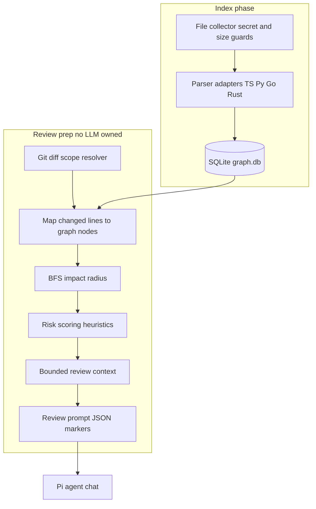

# Research: pi-code-review-graph and graph-aware review context

> **Status:** Research archive complete (June 2026). Consolidates a comparative investigation of [pi-code-review-graph](https://pi.dev/packages/pi-code-review-graph) (CRG) against stet. For the engineering implementation spec derived from this research, see [graph-aware-review-implementation.md](graph-aware-review-implementation.md).

For the broader literature index on context enrichment, false positives, and calibration, see [code-review-research-topics.md](code-review-research-topics.md). For stet's current context tiers (intent, expand, RAG), see [context-enrichment-research.md](context-enrichment-research.md).

---

## 1. Provenance and method

| Field | Value |
|-------|-------|
| **Investigation date** | June 2026 |
| **Trigger** | Discovery of CRG on [pi.dev](https://pi.dev/packages/pi-code-review-graph) as a graph-aware local code review package |
| **Method** | Three parallel read-only Composer runs via `/best-of-n` in isolated git worktrees; npm tarball and GitHub source reviewed; stet codebase and docs compared at HEAD `d5a824d` |
| **Code changes** | None during research |
| **Consensus** | All three runs reached the same architectural conclusion: borrow CRG's **context-shaping** patterns into stet's **hunk pipeline**; do not adopt Pi's extension architecture or single mega-prompt review model |

### Primary sources

- [pi-code-review-graph@0.1.1](https://www.npmjs.com/package/pi-code-review-graph) (npm)
- [github.com/salmanabdurrahman/pi-code-review-graph](https://github.com/salmanabdurrahman/pi-code-review-graph) (source)
- [pi.dev package page](https://pi.dev/packages/pi-code-review-graph)
- [tirth8205/code-review-graph](https://github.com/tirth8205/code-review-graph) (conceptual predecessor; MCP/CLI original)
- Stet: [review-process-internals.md](review-process-internals.md), [roadmap.md](roadmap.md) §10, [context-enrichment-research.md](context-enrichment-research.md)

---

## 2. Why we investigated

Stet reviews **git diff hunks** with per-hunk LLM calls, incremental hunk identity, and post-LLM quality filters. Context enrichment today is **on-demand** (commit intent, Go parent-function expand, RAG symbol definitions, optional Go call-graph via `git grep`).

Roadmap **Phase 10** ([roadmap.md](roadmap.md) §10.1, "Deep Context") plans **cross-file impact analysis** but is **not started**. The design there is grep/symbol-extraction first, without a persistent graph.

**pi-code-review-graph** is the closest **shipped** reference for:

- Repo-local SQLite symbol graph with incremental updates
- Bounded blast-radius (impact BFS) and explainable risk scoring
- Test linkage (`TESTED_BY` edges), monorepo package fan-in/out
- Token-bounded review context with savings metrics

The question was not whether to become a Pi extension, but **what stet can learn** for Phase 10 and context enrichment without abandoning its review product model.

---

## 3. pi-code-review-graph overview

### 3.1 Product shape

CRG is a **Pi agent extension** (npm package with Pi manifest). It:

- Builds and maintains a **repo-local code graph** in SQLite
- Maps git diffs to changed symbols and computes **impact radius**
- Scores **review risk** with explainable heuristics
- Produces **bounded compact context** and queues a strict no-edit review prompt for Pi's active model

CRG **does not** run its own LLM, persist review sessions, stream findings to an IDE, or apply post-LLM false-positive filters. It is **context infrastructure** inside Pi, not a standalone review product.

### 3.2 Architecture



| Layer | Responsibility |
|-------|----------------|
| **Pi extension** (`src/extension.ts`) | Commands, LLM tools, auto context injection on `before_agent_start`, debounced graph updates after edit/write tools |
| **Graph core** (`src/graph/`) | SQLite schema v2, store, BFS impact, risk scoring, package boundaries |
| **Parser layer** (`src/parser/`) | TS/JS via TypeScript Compiler API; Python via stdlib `ast`; Go via `go/parser`; Rust via `web-tree-sitter` + bundled WASM |
| **Repo integration** (`src/repo/`) | Git root detection, config, diff scope resolution, secret/size guards |
| **Review workflow** (`src/context/reviewContext.ts`, `src/commands/review.ts`) | Compact context, strict no-edit prompt, JSON marker contract (`findings`, `readinessScore`) |
| **Observability** | Local `metrics.jsonl` only; no telemetry |

### 3.3 Graph schema (SQLite v2)

**Nodes:** `kind`, `name`, `qualified_name`, `file_path`, line range, `language`, `is_test`, `file_hash`, `confidence_tier`, etc.

**Edges:** `kind` — e.g. `CALLS`, `IMPORTS_FROM`, `TESTED_BY`, `EXPORTS`, `INHERITS`, `IMPLEMENTS`, package `DEPENDS_ON`; `source_qualified`, `target_qualified`, `confidence`.

**Search:** FTS5 virtual table on symbol names (migration v2; graceful fallback when FTS5 unavailable).

### 3.4 Commands

```text
/crg-enable
/crg-disable
/crg-status
/crg-build
/crg-update
/crg-impact <paths>
/crg-review [focus]
/crg-review-panel
/crg-review-actions
/crg-review-feedback
/crg-settings
/crg-search-rebuild
```

### 3.5 LLM tools

Outputs capped at ~50k characters before reaching the model:

- `crg_build_or_update_graph`
- `crg_get_minimal_context`
- `crg_detect_changes`
- `crg_get_impact_radius`
- `crg_query_graph`
- `crg_search_symbols`
- `crg_get_review_context`
- `crg_stats`

### 3.6 Configuration and local artifacts

Default config: `.pi/code-review-graph.json`

Key options: `enabled`, `include`/`exclude`, `enabledLanguages`, `maxFileBytes`, `maxImpactDepth`, `maxImpactNodes`, `maxContextChars`, `autoInjectContext`, `autoUpdateAfterEdit`.

Repo-local storage:

```text
.pi/code-review-graph.json
.pi/code-review-graph/graph.db
.pi/code-review-graph/metrics.jsonl
```

### 3.7 Review scope resolution

Deterministic order (see CRG `src/repo/diff.ts`):

1. Explicit paths passed to `/crg-review`
2. Unstaged diff plus eligible untracked source files
3. Staged-only diff
4. Branch diff vs `@{upstream}`, else `origin/main` / `origin/master` / `main` / `master`

User-provided base refs are validated before being passed to git. Rename/delete records preserve old and new paths in context warnings.

### 3.8 Language support

| Language | Default | Parser | Notes |
|----------|---------|--------|-------|
| TypeScript | Yes | TypeScript Compiler API | Best accuracy; module resolver for imports |
| JavaScript | Yes | TypeScript Compiler API | Same as TS |
| Python | Yes | Local stdlib `ast` | Skipped with warning when `python3` missing |
| Go | Yes | Local `go/parser` | Skipped with warning when `go` missing |
| Rust | Yes | `web-tree-sitter` + bundled WASM | No local Rust toolchain required |

Non-TS **cross-file calls and test links are best-effort** ([LANGUAGE_SUPPORT.md](https://github.com/salmanabdurrahman/pi-code-review-graph/blob/main/docs/LANGUAGE_SUPPORT.md)). Edges are tagged with confidence tiers (`EXTRACTED` vs `HEURISTIC`).

### 3.9 Privacy model

CRG is local-first ([PRIVACY_SECURITY.md](https://github.com/salmanabdurrahman/pi-code-review-graph/blob/main/docs/PRIVACY_SECURITY.md)):

- No telemetry; no default network calls
- Secret path exclusions at index time (`.env`, keys, certs, vendor dirs)
- Graph stores metadata (paths, symbol names, line ranges, edges), not full source dumps
- Review commands are read-only with explicit no-edit instructions
- Local metrics in `metrics.jsonl` contain no source text

### 3.10 Documented limitations (v0.1.1)

- Does not run review LLM; defers to Pi agent and model selection
- No type checker; cross-file resolution is heuristic outside TS/JS
- Python/Go indexing requires local runtimes; missing runtime → warn and skip (build does not fail)
- No session lifecycle, hunk-level approval, or dismiss persistence
- Review output depends on JSON markers in assistant free-form reply
- Local feedback stored but **not auto-injected** into future prompts (`src/review/feedback.ts`)
- Pi-ecosystem only; no standalone CLI or Cursor/VS Code extension

---

## 4. Stet today (comparison baseline)

Documented end-to-end in [review-process-internals.md](review-process-internals.md).

### 4.1 Architecture

| Component | Role |
|-----------|------|
| **Go CLI** (`cli/`) | `stet start` / `run` / `finish` / `status` / `dismiss`; Ollama or OpenAI-compatible backends |
| **Cursor extension** (`extension/`) | NDJSON stream, findings panel, jump-to-line, copy-for-chat, finish review |
| **Session state** (`.review/session.json`) | Baseline ref, `last_reviewed_at`, findings, dismissals, prompt shadows |
| **Worktree** (`.review/worktrees/stet-*`) | Read-only baseline checkout; session anchor |

### 4.2 Review pipeline (per hunk)

1. **Scope:** `git diff baseline..HEAD` → hunks; partition ToReview vs Approved via strict + semantic hunk IDs (`cli/internal/hunkid/`, `cli/internal/scope/`)
2. **Context:** Commit intent, Cursor rules, prompt shadows, Go enclosing function (`cli/internal/expand/expand.go`), RAG symbol defs (`cli/internal/rag/`), optional Go call-graph (`cli/internal/rag/go/callgraph.go`, **default off**)
3. **LLM:** One call per hunk; streaming NDJSON (`progress` / `finding` / `done`)
4. **Post-process:** Abstention, FP kill list, hunk-line evidence filter, optional critic
5. **Persistence:** Incremental `stet run`, auto-dismiss, dismiss → history + shadows, git note on finish

### 4.3 Strengths relative to CRG

- Incremental "already reviewed" via dual-pass hunk identity + `last_reviewed_at`
- Full LLM review pipeline with structured findings schema
- Multi-layer FP reduction (abstention, kill list, critic, prompt shadowing)
- Dismiss-driven learning loop and optional `stet optimize` (DSPy path)
- Cursor rules integration from `.cursor/rules/`
- Controlled local LLM backends with keep-alive pipelining
- Purpose-built IDE contract ([cli-extension-contract.md](cli-extension-contract.md))

### 4.4 Gaps relative to CRG

- No persistent symbol graph or FTS search
- Impact / blast radius limited to optional per-hunk Go call-graph (`git grep` + AST)
- No explainable pre-review risk scoring or hunk ordering by risk
- No `TESTED_BY` / test-file linkage in prompt context
- No monorepo package boundary fan-in/out warnings
- No token-savings telemetry comparing baseline vs enriched context
- Baseline-centric scope only (`baseline..HEAD`); no unstaged/staged WIP modes
- Extension currently starts review with `--dry-run` by default (`extension/src/extension.ts`)

### 4.5 Planned but not built

- **Phase 10.1** cross-file impact ([roadmap.md](roadmap.md) §10.1): grep-based stale-caller findings; status **Not started**
- **Phase 8.1** MCP server ([roadmap.md](roadmap.md))
- Persistent code graph under `.review/` (discussed in research docs only)

---

## 5. Capability matrix (three-run consensus)

| Capability | Stet | CRG | Better / why |
|------------|------|-----|--------------|
| Standalone CLI / CI | Yes | No (Pi-only) | **Stet** — headless, scriptable |
| IDE findings panel + deep links | Yes | Pi review panel | **Stet** — purpose-built contract |
| Incremental "don't re-review" | Yes (hunk IDs + session) | No (re-scopes each review) | **Stet** — core product promise |
| End-to-end LLM review | Yes (per hunk) | No (prompt only) | **Stet** |
| Persistent symbol graph | No | Yes (SQLite + FTS) | **CRG** |
| Impact / blast radius | Partial (Go call-graph, opt-in) | Multi-edge BFS + package stats | **CRG** |
| Risk prioritization | Implicit (prompt + abstention) | Scored + reason strings | **CRG** |
| Test coverage linkage | No | `TESTED_BY` edges | **CRG** |
| Monorepo package boundaries | No | fan-in/out per package | **CRG** |
| Review unit | Per hunk | Single graph-aware prompt | **Stet** for large diffs; **CRG** for holistic narrative |
| False-positive controls | Abstention, FP list, critic, shadows | Prompt-only | **Stet** |
| Dismiss / learning loop | History, shadows, optimizer | Local feedback, not injected | **Stet** |
| Token budgeting | Per-hunk caps + RAG limits | `maxContextChars` + savings metric | **Tie** — CRG's savings metric is richer |
| Languages (indexing) | RAG: Go, TS/JS, Py, Swift, Java; expand/call-graph: Go | Graph index: TS/JS/Py/Go/Rust | **Mixed** |
| Privacy / local-first | Yes | Yes | **Tie** |
| Secret handling at collection | Git-tracked diff only | Explicit exclusions at index | **CRG** |
| Readiness score | No | `readinessScore` in JSON contract | **CRG** |
| Review scope modes | `baseline..HEAD` | unstaged → staged → branch | **CRG** for WIP; **Stet** for PR-style |
| Agent tool surface | CLI flags | 8 typed LLM tools | **CRG** (relevant if stet adds MCP) |
| Auto context on coding prompts | No | Keyword-triggered inject | **CRG** (Pi-specific; out of scope for stet) |

---

## 6. Actionable learnings for stet

Evidence-tied recommendations. Implementation detail is in [graph-aware-review-implementation.md](graph-aware-review-implementation.md).

1. **Run-level impact preamble** — Map diff → symbols → bounded BFS (depth/node caps); inject once per run, not per hunk. Reuse `cli/internal/rag/go/callgraph.go`; evolve toward optional `.review/graph.db`.

2. **Explainable risk scoring for hunk ordering** — Port CRG heuristics: missing test edge, fan-in, security/route path keywords, package entrypoints. Sort `ToReview` hunks; use for **ordering**, not silent skip until calibrated.

3. **Test proximity / `TESTED_BY` linkage** — Inject `## Related tests (not in diff)` when changed symbols have co-located or grep-discoverable test files.

4. **Token-savings telemetry** — Log baseline (hunk-only) vs enriched prompt size per hunk and run; expose in `--trace` and git notes (Phase 9 alignment).

5. **Monorepo package fan-in/out** — Lightweight detection of `cli/` / `extension/` / `packages/` roots; warn on cross-package blast radius in impact summary.

6. **Secret/sensitive path exclusion** — Extend diff and RAG collection excludes (`.env`, keys, certs, vendor) at collection time.

7. **Confidence tiers on injected context** — Label AST-resolved vs grep-heuristic blocks in prompts to reduce false confidence.

8. **Incremental graph maintenance** — If graph is added, update only files in `baseline..HEAD` diff plus one-hop dependents on `stet run`.

9. **Cross-file stale-usage findings** — Implement roadmap §10.1: emit `findings.Finding` when a changed symbol has references in files not in the diff.

10. **CLI scope modes** — Optional `--scope unstaged|staged|branch` for pre-commit workflows (CRG `resolveReviewScope` pattern).

11. **Readiness score** — Optional session-level aggregate in NDJSON `done` event, derived from filtered severities (no second LLM).

12. **Extension live review** — Setting-driven live `stet start --stream` instead of default `--dry-run`.

13. **MCP tools (future)** — When Phase 8.1 lands: `stet_get_impact_radius`, `stet_get_review_context` backed by same impact/graph layer.

---

## 7. What stet already does better

- **Review product, not context plugin** — Complete lifecycle, findings schema, extension UX, git notes ([PRD.md](PRD.md))
- **Incremental hunk approval** — Strict + semantic IDs prevent flip-flopping; CRG re-reviews entire change sets
- **Precision stack** — Abstention, FP kill list, nitpicky mode, prompt shadowing, DSPy optimizer path
- **Multi-backend LLM** — Ollama + OpenAI-compatible; CRG defers to Pi's model
- **Per-hunk streaming NDJSON** — Findings as they arrive vs one monolithic prompt
- **Dismiss-driven learning** — History → shadows → optimize; CRG feedback is write-only
- **Go-first production CLI** — Single static binary; no Bun/Node in critical path
- **Worktree session model** — Clear "review since baseline" semantics
- **Cursor rules integration** — Project-specific review criteria CRG does not ingest

---

## 8. Risks and anti-patterns

| CRG pattern | Risk for stet | Mitigation |
|-------------|---------------|------------|
| Single mega-prompt review | Blows 32k context on large branches; loses hunk-level evidence filter | Keep hunk pipeline; graph context as run-level or hunk-level **preamble**, bounded |
| Full SQLite graph as v1 requirement | Index build time, parser maintenance, stale-graph debt | Grep/AST first (Phase 10); graph as **optional** `graph_index_enabled` |
| Best-effort cross-file edges as ground truth | False impact/risk signals, hallucinated breakage | Tag confidence; degrade to hunk-only when stale |
| External runtime deps for index (python/go subprocess) | Conflicts with single-binary simplicity | Prefer in-process `go/ast`; subprocess only where unavoidable |
| Replacing post-LLM filters with graph | CRG relies on model + prompt; stet's abstention/critic are proven FP reducers | Graph informs **context and ordering** only |
| Pi-style auto-inject on keyword match | Surprise prompt bloat in CLI/extension | Explicit flags; default off |
| Readiness score without calibration | Misleading "LGTM" on bad diffs | Derive from filtered findings; document limitations |
| Blocking review on graph freshness | Failed runs when index lags HEAD | Warn in trace/status; fall back to grep/AST |
| Duplicating tirth8205/code-review-graph MCP | Reinventing 17k-star MCP project | Integrate patterns natively; optional external MCP consumption later |

---

## 9. Relationship to existing stet research

| Document | Relationship |
|----------|--------------|
| [context-enrichment-research.md](context-enrichment-research.md) | Tier 3 "relational context" (RAG-lite) is stet's current answer to CRG's graph spokes; graph-aware review extends Tier 3 with persistent structure |
| [reasoning-retrieval-review-directions.md](reasoning-retrieval-review-directions.md) | §3 hierarchical index and §4 cross-cutting deep pass align with impact radius and cross-file findings |
| [roadmap.md](roadmap.md) §10 | Phase 10.1 cross-file impact is the primary stet landing zone for CRG ideas |
| [defect-focused-review-plan.md](defect-focused-review-plan.md) | Risk ordering complements precision–recall modes and defect-focused prompts |
| [review-process-internals.md](review-process-internals.md) | §7.7a optional Go call-graph is the nearest existing implementation |
| [implementation-plan.md](implementation-plan.md) | Phase 9 stats/telemetry aligns with CRG `metrics.jsonl` and token-savings patterns |

---

## 10. Open questions for engineering

1. **SQLite in Go CLI** — Use `database/sql` with embedded SQLite vs grep-only v1? Trade index freshness vs binary size and CGO/toolchain concerns.
2. **Graph staleness policy** — Warn only vs auto-incremental update on every `stet run` vs explicit `stet graph build`.
3. **Readiness score formula** — Weight severities and confidence how? Should dismiss history affect score?
4. **Risk score as filter** — When (if ever) may high/recall modes skip low-risk hunks vs order-only?
5. **TS/JS graph indexing priority** — Stet monorepo is Go + TypeScript; order parsers after Go or in parallel?
6. **Scope modes vs session baseline** — How does `--scope unstaged` interact with `stet start [<ref>]` baseline worktree semantics?
7. **Embedding CRG vs native** — Consume CRG via future MCP vs build native impact layer in Go (consensus: **native** for CLI coherence).

---

## 11. Conclusion

**pi-code-review-graph** is a strong reference for **how to shrink and prioritize review context** using a local symbol graph, explainable risk, and monorepo-aware impact — but it is an **agent copilot plugin**, not a review product with session semantics or false-positive controls.

**Stet** is already ahead on **incremental review, finding lifecycle, LLM pipeline quality, and IDE integration**. The highest-value CRG ideas are **bounded impact context**, **risk-based hunk ordering**, **test linkage**, **token telemetry**, and **optional persistent indexing** — implemented as extensions to the existing hunk pipeline and Phase 10 roadmap, not as a replacement architecture.

---

## 12. References

- [pi-code-review-graph on pi.dev](https://pi.dev/packages/pi-code-review-graph)
- [pi-code-review-graph on npm](https://www.npmjs.com/package/pi-code-review-graph)
- [pi-code-review-graph source (GitHub)](https://github.com/salmanabdurrahman/pi-code-review-graph)
- [CRG PRIVACY_SECURITY.md](https://github.com/salmanabdurrahman/pi-code-review-graph/blob/main/docs/PRIVACY_SECURITY.md)
- [CRG LANGUAGE_SUPPORT.md](https://github.com/salmanabdurrahman/pi-code-review-graph/blob/main/docs/LANGUAGE_SUPPORT.md)
- [CRG RELEASE_NOTES_0_1_0.md](https://github.com/salmanabdurrahman/pi-code-review-graph/blob/main/docs/RELEASE_NOTES_0_1_0.md)
- [tirth8205/code-review-graph](https://github.com/tirth8205/code-review-graph) (inspiration / MCP original)
- Stet: [graph-aware-review-implementation.md](graph-aware-review-implementation.md) (engineering spec derived from this research)
