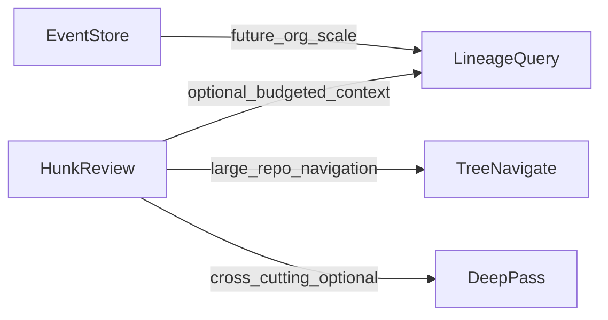

# Reasoning-based retrieval and advanced review directions

> **Status:** Research and roadmap. Not a substitute for [PRD.md](PRD.md) or [implementation-plan.md](implementation-plan.md). Items below are **proposed** directions unless an existing feature is explicitly referenced.

This document captures five directions inspired by **hierarchical, reasoning-style retrieval** (see [VectifyAI/PageIndex](https://github.com/VectifyAI/PageIndex): tree-structured document indexes, navigable retrieval, traceable paths) and by recent work on **LLM-assisted and agentic code review**. The lessons are **language-agnostic**; stet’s implementation remains Go/TypeScript as today.

**Impact order:** Sections are numbered **1 (highest expected improvement for stet) through 5 (lowest near-term improvement)**, balancing leverage against effort given stet’s diff/hunk pipeline, `.review/` state, dismiss reasons, optimizer, and local-first defaults.

**Related docs:** Tiered context enrichment (commit intent, scope expansion) is specified in [context-enrichment-research.md](context-enrichment-research.md). Broader literature index: [code-review-research-topics.md](code-review-research-topics.md). Prompt quality and dismiss reasons: [review-quality.md](review-quality.md).

---

## How these layers relate (optional)

---

## 1. Explicit precision–recall frontier (highest impact)

### Idea

Treat **noise vs coverage** as a first-class product surface: named review **modes** (e.g. merge-gate vs exploratory audit), documented **tradeoffs**, and **measurement** (internal golden PRs, category-level stats, dismiss-rate by mode). Recent benchmarking work stresses that review agents sit on a **precision–recall frontier**—aggressive issue-finding often produces low signal-to-noise and weak real-world adoption.

### Why it helps stet

Stet already optimizes for **precision** (actionable findings, abstention, dismiss reasons feeding `stet optimize` and prompt shadowing). Formalizing modes and regression checks would **compound** that foundation without new retrieval infrastructure. It aligns with findings that AI review suggestions may see **lower adoption** than human feedback when noise dominates.

### Risks and constraints

- Golden sets require **maintenance**; avoid flaky or leaked benchmarks.
- Modes must stay **discoverable** in CLI and extension copy so users do not misconfigure strictness.

### Concrete next steps (design)

- Define **2–3 preset profiles** (names, default strictness, intended use) in config contract docs; map to existing presets where applicable.
- Add a **small curated set** of branch diffs (or recorded hunks) for regression prompt/tests; document how to refresh them.
- Extend [review-quality.md](review-quality.md) or stats output with **mode-aware** guidance (when to raise recall vs protect precision).

### References

- [CR-Bench: Evaluating the Real-World Utility of AI Code Review Agents](https://arxiv.org/abs/2603.11078)
- [Human-AI Synergy in Agentic Code Review](https://arxiv.org/html/2603.15911v1)
- [CodeFuse-CR-Bench (repo-level CR evaluation)](https://arxiv.org/abs/2509.14856)

---

## 2. Git lineage as a curated store (not a raw history dump)

### Idea

Use **git metadata as an indexed, budgeted lineage layer**: short summaries, “last touched” pointers, optional links from paths to impactful commits—not the full `git log` or every diff in the prompt. Retrieval-augmented code review work (e.g. LAURA) shows value from **context-enriched** review generation; separate work warns that **more retrieval can hurt** when the context budget fills with redundant or conflicting material.

### Why it helps stet

[context-enrichment-research.md](context-enrichment-research.md) already prioritizes **Tier 1: commit intent** from `baseline..HEAD`. A lineage store extends that with **structured, queryable facts** (per-path recency, one-line commit summaries, optional tags) while respecting token caps. It complements `.review/history.jsonl` (dismiss and session history) without conflating “model feedback history” with “repository evolution.”

### Risks and constraints

- **Over-injection** of historical snippets can degrade review quality; cap items and prefer **top-1** or very small sets where evidence suggests that helps.
- Local-only workflows may lack issue tracker text; lineage should **degrade gracefully** to commit messages and paths.

### Concrete next steps (design)

- Specify a **lineage cache** format under `.review/` (e.g. JSON or JSONL) built incrementally from `git log --name-only` / similar, with TTL or invalidation on fetch.
- Define **priority order** when truncating: e.g. paths touched in current session first, then recent parents of those paths, then repo-wide recency with decay.
- Document interaction with **Tier 1** in [context-enrichment-research.md](context-enrichment-research.md) so prompts stay a single coherent story.

### References

- [LAURA: Enhancing Code Review Generation with Context-Enriched Retrieval-Augmented LLM](https://arxiv.org/abs/2512.01356)
- [When More Retrieval Hurts: Retrieval-Augmented Code Review Generation](https://arxiv.org/html/2511.05302v2)
- [gitbrief](https://github.com/faw21/gitbrief) (git-history-aware, budgeted context)
- [Augment: Context lineage (commit history for agents)](https://augmentcode.com/blog/announcing-context-lineage)

---

## 3. Hierarchical repo index and reasoning-style navigation (PageIndex analogue)

### Idea

Build or lazily maintain a **tree-structured index** of the repository (e.g. subsystem → package → key files → summarized nodes), analogous to PageIndex’s TOC-style tree. Retrieval becomes **navigate and expand** branches with explicit reasoning steps rather than relying solely on flat chunking or naive similarity. For code, **scope-based hierarchies** (module / type / function skeletons) are a well-explored pattern.

### Why it helps stet

Stet reviews **per hunk**; large repos make it hard to see **where a change sits** in the architecture. A hierarchical index supports **explainable** “why this context was included” and can reduce irrelevant surrounding code. It is especially useful when Tier 2 scope expansion still misses **cross-file** structure.

### Risks and constraints

- **Build and refresh cost**: index generation may require batch passes or background jobs; must not block the core `stet start` / `stet run` path unless optional.
- **Stale index** edges: document invalidation (e.g. on commit, or lazy per-path refresh).

### Concrete next steps (design)

- Prototype **read-only index artifact** (e.g. under `.review/` or cache dir) with versioned schema; start with **directory + package** levels before full AST summaries.
- Define a **maximum expansion depth** and token budget for “tree walk” context injection per hunk.
- Evaluate alignment with existing **tree-sitter / scope** plans in [implementation-plan.md](implementation-plan.md) Phase 6 rather than duplicating parsers.

### References

- [PageIndex (vectorless, reasoning-based RAG)](https://github.com/VectifyAI/PageIndex)
- [LlamaIndex: CodeHierarchyNodeParser example notebook](https://github.com/run-llama/llama_index/blob/main/llama-index-packs/llama-index-packs-code-hierarchy/examples/CodeHierarchyNodeParserUsage.ipynb)

---

## 4. Agentic bounded exploration (second-phase deep pass)

### Idea

After or alongside the default hunk review, offer an **optional, strictly bounded** agentic pass: tool-using loop that reads related files (imports, callers, tests) with step limits and token ceilings—similar in spirit to **deep codebase analysis** agents that use search-like exploration and checkpoints.

### Why it helps stet

Many high-value issues are **cross-cutting** (API contracts, error handling across files, test gaps). A bounded second phase could **upgrade or retract** findings based on evidence outside the hunk, while staying compatible with stet’s **review-only** stance (suggestions, not auto-fix).

### Risks and constraints

- **Latency and cost** multiply; must remain **opt-in** with clear UX (CLI flag, config).
- **Determinism and tests**: tool loops need golden mocks and caps to avoid flaky CI.
- Local models may **underperform** on multi-step tool use; profile before default-on behavior.

### Concrete next steps (design)

- Specify **tool contract** (list file, read range, grep-like search) and **hard limits** (max steps, max bytes read per step).
- Define **when to invoke**: e.g. user flag, or heuristic (severity, category, file pattern).
- Document **failure mode**: timeout → fall back to single-pass hunk review only.

### References

- [SWE-Adept: LLM-Based Agentic Framework for Deep Codebase Analysis](https://arxiv.org/abs/2603.01327)
- [Agentic Code Review Architecture (tool-calling overview)](https://agentpatterns.ai/code-review/agentic-code-review-architecture/)

---

## 5. Structured commit/event store and temporal graphs (lowest near-term impact)

### Idea

Treat commits, reviews, dismissals, and (optionally) CI events as rows in a **structured event log** or graph: nodes for paths/symbols/commits, edges for “introduced in,” “touched by,” “finding X dismissed as Y.” Over time this enables **org-scale** learning, analytics, and narrative explanations (“this API stabilized after commit …”).

### Why it helps stet

[implementation-plan.md](implementation-plan.md) already notes **history schema** designed for future bulk export. A richer event model could power **routing** (which prompt variant to use), **retrieval of a single best exemplar** (consistent with caution about excess retrieval), and **impact reporting** (Phase 9 direction).

### Risks and constraints

- **Scope creep** toward a full database product; privacy and **opt-in sync** matter for teams.
- Graph maintenance is **expensive**; value is back-loaded until volume and tooling exist.

### Concrete next steps (design)

- Extend schema sketches for **exportable** events (no implicit local-only IDs that break merge).
- Prototype **read-only** queries in analysis scripts before any networked service.
- Keep **stet core** a static binary where possible; sidecars for heavy analytics if needed.

### References

- [ReviewScope](https://github.com/Review-scope/ReviewScope) (multi-signal PR review tooling)
- [implementation-plan.md](implementation-plan.md) (history export, Phase 9 impact reporting)

---

## Sources (external)

- [PageIndex (GitHub)](https://github.com/VectifyAI/PageIndex)
- [CR-Bench (arXiv)](https://arxiv.org/abs/2603.11078)
- [Human-AI Synergy in Agentic Code Review (arXiv html)](https://arxiv.org/html/2603.15911v1)
- [CodeFuse-CR-Bench (arXiv)](https://arxiv.org/abs/2509.14856)
- [LAURA (arXiv)](https://arxiv.org/abs/2512.01356)
- [When More Retrieval Hurts (arXiv html)](https://arxiv.org/html/2511.05302v2)
- [SWE-Adept (arXiv)](https://arxiv.org/abs/2603.01327)
- [gitbrief (GitHub)](https://github.com/faw21/gitbrief)
- [Augment: Context lineage](https://augmentcode.com/blog/announcing-context-lineage)
- [LlamaIndex CodeHierarchy notebook (GitHub)](https://github.com/run-llama/llama_index/blob/main/llama-index-packs/llama-index-packs-code-hierarchy/examples/CodeHierarchyNodeParserUsage.ipynb)
- [AgentPatterns: Agentic code review architecture](https://agentpatterns.ai/code-review/agentic-code-review-architecture/)
- [ReviewScope (GitHub)](https://github.com/Review-scope/ReviewScope)
