# Stet Review Process: Internals

This document describes how a code review flows through Stet from start to finish: worktree creation, scope computation, diff and hunks, per-hunk review (prompts, filters, LLM), and how results are returned and persisted. It is intended for engineers who want to understand or modify the application internals. The **code is the source of truth**; this doc summarizes and points to it. To follow along while running a review, use **`--trace`** on `stet start` or `stet run`; it prints each internal step (partition, rules, RAG, prompts, LLM I/O) to stderr.

---

## 1. Bird's-eye flow

```mermaid
flowchart TB
  subgraph startFlow [stet start]
    validate[Validate repo ref clean worktree]
    refCheck{ref equals HEAD?}
    exitEarly[Save session no worktree exit]
    ollamaCheck[Ollama check unless dry-run]
    createWorktree[Create worktree save session]
    partition[Partition baseline HEAD to ToReview Approved]
    loopHunks[For each hunk: prompt Ollama parse filters stream]
    autoSave[Auto-dismiss save session stream done]
    validate --> refCheck
    refCheck -->|yes| exitEarly
    refCheck -->|no| ollamaCheck
    ollamaCheck --> createWorktree
    createWorktree --> partition
    partition --> loopHunks
    loopHunks --> autoSave
  end

  subgraph runFlow [stet run incremental]
    loadSession[Load session]
    partitionRun[Partition with lastReviewedAt]
    onlyNew[Only new or changed hunks to ToReview]
    samePipeline[Same per-hunk pipeline]
    mergeFindings[Merge new findings update LastReviewedAt]
    loadSession --> partitionRun --> onlyNew --> samePipeline --> mergeFindings
  end

  subgraph finishFlow [stet finish]
    removeWorktree[Remove session worktree]
    historyNote[Append history record write git note]
    removeWorktree --> historyNote
  end
```

**In one paragraph:** The user (or extension) runs `stet start [ref]`. The CLI validates the repo and ref, creates a read-only worktree at the baseline ref, and saves a session. It computes which hunks to review by diffing `baseline..HEAD` and partitioning into "to-review" vs "already approved" using strict and semantic hunk IDs. Each to-review hunk goes through a pipeline: system prompt plus user intent, Cursor rules, optional nitpicky instructions (when `--nitpicky`), optional expand, user prompt, optional RAG, then Ollama, parse, abstention and FP kill list filters (FP kill list skipped when nitpicky), finding IDs and URIs. Findings are streamed (NDJSON) and stored in the session. Auto-dismiss marks previous findings that lie in re-reviewed hunks but were not re-reported. Later, `stet run` only reviews hunks that are new or changed since `last_reviewed_at`. Finish removes the worktree and writes a git note; status and list read from the session; dismiss adds a finding ID to the dismissed list and optionally records a reason and prompt shadow for future runs.

---

## 2. Glossary

| Term | Meaning |
|------|--------|
| **Baseline** | The ref (commit or branch) that review is "from." All changes are measured as `baseline..HEAD`. Default for `stet start` is `HEAD`; often you pass e.g. `HEAD~5` to review the last 5 commits. |
| **last_reviewed_at** / **LastReviewedAt** | The ref (usually a SHA) of the last successful review run. Used to partition hunks into "already reviewed" vs "to review." Stored in session. |
| **Worktree** | A separate checkout of the repo at a given ref. Stet creates one at the baseline (e.g. `repo/.review/worktrees/stet-<short-sha>`). It is not used for computing diffs or reading file content; those use the main repo (repo root). |
| **Hunk** | One contiguous block of a unified diff (one `@@ -old +new @@` section). Stet reviews at hunk granularity: one hunk → one prompt → one JSON array of findings. |
| **Strict hunk ID** | Hash of `filePath:normalizedContent` (CRLF→LF). Used for exact "already reviewed" match. |
| **Semantic hunk ID** | Hash of `filePath:codeOnly(content)` (comments/whitespace stripped per language: Go, Python, JS/TS, Shell). Used to treat comment/whitespace-only changes as already reviewed. |
| **ToReview / Approved** | Partition of current hunks. **Approved** = in the "reviewed" set (strict or semantic match); **ToReview** = the rest (sent to the LLM). |
| **Finding** | One issue reported by the model: file, line or range, severity, category, confidence, message, optional suggestion. Stored in session; can be dismissed so it does not resurface. |
| **Dismissed** | Finding IDs the user (or auto-dismiss logic) marked as "won't fix" or false positive. Stored in `session.DismissedIDs`. Output (JSON, human, list, status) shows only "active" findings (not in DismissedIDs). |
| **Abstention** | Post-LLM filter: drop findings below confidence thresholds (e.g. &lt; 0.8 keep, &lt; 0.9 for maintainability). |
| **FP kill list** | Post-LLM filter: drop findings whose message matches banned phrases (e.g. "Consider adding comments"). Can be disabled with strictness "+" presets or **`--nitpicky`**. |
| **Nitpicky mode** | When **`--nitpicky`** is set (or `nitpicky = true` in config / `STET_NITPICKY`), the system prompt is augmented with instructions to report typos, grammar, style, and convention violations; the FP kill list is not applied so those findings surface. Session can persist nitpicky so `stet run` uses it unless overridden. |
| **Prompt shadows** | Dismissed finding contexts stored and re-injected as negative examples ("do not report similar issues") in later reviews. |
| **State dir** | Directory for session and history; usually `repo/.review`. |

---

## 3. How a review starts

### 3.1 CLI: `stet start [ref]`

- **Entry:** `run.Start()` in [cli/internal/run/run.go](cli/internal/run/run.go) (invoked from [cli/cmd/stet/main.go](cli/cmd/stet/main.go)).
- **Validation:**
  - `RepoRoot` and `StateDir` required.
  - `git.IsClean(repoRoot)` unless `AllowDirty` (then only a warning).
  - `session.AcquireLock(stateDir)` so only one start/run at a time.
  - `ref` defaults to `"HEAD"`; resolve to SHA via `git.RevParse`.
- **Early exit:** If `sha == headSHA` (baseline is HEAD), no worktree is created and no Ollama call is made. Session is saved with `LastReviewedAt = headSHA` and the function returns.
- **Ollama check:** Unless dry-run, `ollama.Client.Check(ctx, model)` is called so a wrong URL or missing model fails before creating the worktree.
- **Worktree:** `git.Create(repoRoot, worktreeRoot, ref)`; on any subsequent error in `Start`, a `defer` removes this worktree.
- **Session:** `session.Save(stateDir, &s)` with `BaselineRef = sha`, `LastReviewedAt = ""`, `DismissedIDs = nil`.
- **Partition:** `scope.Partition(ctx, repoRoot, sha, headSHA, "", nil)` — first run: empty `lastReviewedAt`, so all current hunks go to ToReview.
- **Loop:** For each hunk in `part.ToReview`, run the per-hunk pipeline (see §7); then auto-dismiss, update session (`Findings`, `FindingPromptContext`, `LastReviewedAt`), and stream `done` if applicable.

### 3.2 Extension: Start Review

- **Entry:** Command `stet.startReview` in [extension/src/extension.ts](extension/src/extension.ts).
- **Flow:** Resolves workspace folder as repo root (`getRepoRoot()`), sets the findings panel to "scanning," then calls `spawnStetStream(["start", "--dry-run", "--quiet", "--json", "--stream"], { cwd })` (see [extension/src/cli.ts](extension/src/cli.ts)).
- **Important:** The extension currently uses **`--dry-run`**, so the CLI does not call Ollama; it uses canned findings (one per hunk) for fast feedback. Full LLM review is done by running `stet start` or `stet run` from the terminal without `--dry-run`.
- **Stream handling:** Each stdout line is parsed with `parseStreamEvent(line)` in [extension/src/parse.ts](extension/src/parse.ts). Events: `progress`, `finding`, `done`. Findings are accumulated and the panel is updated on each `finding`; on `done` scanning stops. On non-zero exit or parse error, the panel is cleared and an error is shown.

---

## 4. Worktree: creation, role, and cleanup

### 4.1 Creation

- **Package:** [cli/internal/git/worktree.go](cli/internal/git/worktree.go).
- **Path:** `PathForRef(repoRoot, worktreeRoot, ref)` → `repoRoot/.review/worktrees/stet-<short-12-sha>` (or `worktreeRoot/stet-<short-sha>` if `WorktreeRoot` is set). Short SHA from `git rev-parse --short=12 ref`.
- **Create:** `Create(repoRoot, worktreeRoot, ref)`:
  - Ensures `ref` is an ancestor of HEAD via `IsAncestor(repoRoot, ref, "HEAD")`; else returns `ErrBaselineNotAncestor`.
  - If the path already exists or `git worktree add` reports existing worktree → `ErrWorktreeExists`.
  - Runs `git worktree add <path> <ref>`.

### 4.2 Role of the worktree

- **Diffs and file reads** use the **main repository root** (the current working tree), not the baseline worktree path. "What to review against" is the **baseline ref (SHA)** used in `git diff baseline..HEAD` run from the main repo; that diff defines what changed and is split into hunks.
- `git diff baseline..HEAD` is run with `cmd.Dir = repoRoot` in [cli/internal/diff/diff.go](cli/internal/diff/diff.go).
- **Expand** (enclosing function) and **RAG** (symbol definitions) read files under `repoRoot` (HEAD state); see [cli/internal/expand/expand.go](cli/internal/expand/expand.go) and [cli/internal/rag/rag.go](cli/internal/rag/rag.go).
- The worktree's main roles are: (1) represent "we have a session at this baseline," (2) provide a path for `stet status` and for cleanup, (3) ensure only one session per baseline (path uniqueness).

### 4.3 Cleanup

- **Finish:** `run.Finish()` computes the session worktree path via `git.PathForRef(repoRoot, worktreeRoot, s.BaselineRef)`. If the path exists, calls `git.Remove(repoRoot, path)` (`git worktree remove`). Session file is not deleted; only the worktree is removed.
- **Cleanup command:** `stet cleanup` lists worktrees, removes those under the configured worktree root whose name starts with `stet-` and whose path is **not** the current session's worktree (i.e. orphans).

---

## 5. Session and scope (what to review)

### 5.1 Session state

- **Package:** [cli/internal/session/session.go](cli/internal/session/session.go).
- **File:** `stateDir/session.json` (typically `repo/.review/session.json`).
- **Fields:** `SessionID`, `BaselineRef`, `LastReviewedAt`, `DismissedIDs`, `PromptShadows`, `FindingPromptContext`, `Findings`. Load/save and advisory lock (`.review/lock`) live in this package.

### 5.2 Partition (ToReview vs Approved)

- **Package:** [cli/internal/scope/scope.go](cli/internal/scope/scope.go); function `Partition(ctx, repoRoot, baselineRef, headRef, lastReviewedAt, opts)`.
- **Current hunks:** `diff.Hunks(ctx, repoRoot, baselineRef, headRef, opts)` → `git diff baseline..HEAD`, parsed and filtered.
- **Reviewed hunks:** If `lastReviewedAt != ""`, `diff.Hunks(ctx, repoRoot, baselineRef, lastReviewedAt, opts)`.
- **IDs:** For each reviewed hunk, compute `StrictHunkID(filePath, rawContent)` and `SemanticHunkID(filePath, rawContent)` in [cli/internal/hunkid/hunkid.go](cli/internal/hunkid/hunkid.go). Build sets of strict and semantic IDs.
- **Split:** For each current hunk, if its strict ID is in the reviewed set → Approved; else if its semantic ID is in the reviewed set → Approved; else → ToReview.
- **First run:** When `lastReviewedAt == ""`, all current hunks go to ToReview and Approved is empty.

---

## 6. Diff pipeline: from git diff to hunks

### 6.1 Running the diff

- **Package:** [cli/internal/diff/](cli/internal/diff/) (`diff.go`, [parse.go](cli/internal/diff/parse.go)).
- **Command:** `git diff --no-color --no-ext-diff baseline..head` run from `repoRoot` with `GIT_DIR` set so the repo is unambiguous (e.g. in worktrees).
- **Output:** Raw unified diff string.

### 6.2 Parsing

- **ParseUnifiedDiff** in [cli/internal/diff/parse.go](cli/internal/diff/parse.go): Split by `diff --git ` into per-file sections. Skip sections that contain "Binary files … differ" (no hunks for binary files).
- **Per file:** Parse `---`/`+++` paths and lines starting with `@@ -oldStart,oldCount +newStart,newCount @@`; collect following context lines (space, `-`, `+`). Each `@@` block becomes one `diff.Hunk` with `FilePath` (HEAD side, from `+++`), `RawContent` (the block including the `@@` line), `Context` (same as RawContent by default).

### 6.3 File-level filters

- **filterByPatterns** in [cli/internal/diff/diff.go](cli/internal/diff/diff.go): Exclude hunks whose `FilePath` matches the exclude list. Default patterns: `*.pb.go`, `*_generated.go`, `*.min.js`, `package-lock.json`, `go.sum`, `vendor/`, `coverage/` (and paths under them). Only **tracked** files appear in the diff (`.gitignore` is respected by Git).

---

## 7. Per-hunk review pipeline

For each hunk in `part.ToReview`, the following steps run in order. Code lives in [cli/internal/review/review.go](cli/internal/review/review.go) (`ReviewHunk`) and [cli/internal/run/run.go](cli/internal/run/run.go) (loop and filters).

### 7.1 System prompt

- **Load:** `prompt.SystemPrompt(stateDir)` in [cli/internal/prompt/prompt.go](cli/internal/prompt/prompt.go) — reads `.review/system_prompt_optimized.txt` if present and non-empty, else uses `DefaultSystemPrompt` (defect-focused review instructions and JSON schema).

### 7.2 User intent

- **Inject:** `prompt.InjectUserIntent(system, branch, commitMsg)`. Replaces the "## User Intent" section with branch and last commit message from `git.UserIntent(repoRoot)`.

### 7.3 Cursor rules

- **Load (per hunk):** A `rules.Loader` is created once per start/run via `rules.NewLoader(repoRoot)`. For each hunk, `loader.RulesForFile(hunk.FilePath)` returns the merged rule list: rules from the repo root `.cursor/rules/` plus rules from any nested `.cursor/rules/` directory whose path is a prefix of the file (e.g. for `cli/internal/run/run.go`, root and `cli/.cursor/rules/`; not `extension/.cursor/rules/`). Discovery is in [cli/internal/rules/loader.go](cli/internal/rules/loader.go) (`DiscoverRulesDirs`); each physical rules dir is loaded once and cached. Merged order is root first, then nested dirs by relative path (lexicographic).
- **Description-based inference:** Rules are parsed from `.mdc` frontmatter (`globs`, `alwaysApply`, `description`). If a rule has no `globs` and not `alwaysApply` but has a non-empty `description`, glob patterns are inferred locally from the description (keyword table: e.g. "TypeScript", "Go", "frontend" → `*.ts`/`*.tsx`, `*.go`, `frontend/*`) so the rule applies at the right time without an LLM. See `InferGlobsFromDescription` in [cli/internal/rules/rules.go](cli/internal/rules/rules.go).
- **Append:** `prompt.AppendCursorRules(system, ruleList, hunk.FilePath, maxRuleTokens)`. Filters `ruleList` by file path (alwaysApply or glob match), orders always-apply first, truncates to token budget, appends "## Project review criteria".

### 7.3a Nitpicky mode

- When **`--nitpicky`** is set (or config/env `nitpicky = true`), **Append:** `prompt.AppendNitpickyInstructions(system)` adds a "## Nitpicky mode" section: persona (thorough staff engineer), do not discard style/nitpick findings, and check typos/grammar in comments and identifiers. The FP kill list is not applied so convention/comment/typo findings are kept. See [cli/internal/prompt/prompt.go](cli/internal/prompt/prompt.go).

### 7.4 Prompt shadows (negative examples)

- **Append:** `prompt.AppendPromptShadows(system, promptShadows)`. Up to 5 recent dismissed-finding contexts (from session `PromptShadows`) are appended as "## Negative examples (do not report)" so the model does not re-report similar issues.

### 7.5 Optional expand (Go only)

- **Package:** [cli/internal/expand/expand.go](cli/internal/expand/expand.go).
- If `repoRoot != ""` and `contextLimit > 0`, `expand.ExpandHunk(repoRoot, hunk, maxExpand)` runs. For `.go` files only: parses the **current** file (HEAD) from repo root, finds the smallest enclosing function containing the hunk's line range, and prepends "## Enclosing function context" plus the function source to the hunk's context. File is read from `repoRoot` (main worktree).

### 7.6 User prompt

- **Build:** `prompt.UserPrompt(hunk)` — "File: &lt;path&gt;\n\n" + (expanded or raw) content.

### 7.7 Optional RAG (symbol definitions)

- **Package:** [cli/internal/rag/rag.go](cli/internal/rag/rag.go). If `ragMaxDefs > 0`, `rag.ResolveSymbols(ctx, repoRoot, hunk.FilePath, hunk.RawContent, opts)` is called. Dispatches by file extension to a registered resolver (e.g. Go, TypeScript, Python); returns definitions (signature + optional docstring). These are appended to the user prompt as "## Symbol definitions" (truncated to token budget).

### 7.8 LLM call

- **Ollama:** `client.Generate(ctx, model, system, user, genOpts)`. On malformed JSON response, the generate call is retried once; on second parse failure an error is returned.

### 7.9 Parse and assign IDs

- **Parse:** `review.ParseFindingsResponse(raw)` in [cli/internal/review/parse.go](cli/internal/review/parse.go) — accepts a bare JSON array of findings or an object with a `findings` key.
- **IDs:** `review.AssignFindingIDs(list, hunk.FilePath)` — sets `File` from hunk if missing, default `Confidence` 1.0 if 0, then `ID = hunkid.StableFindingID(file, line, rangeStart, rangeEnd, message)`. Validates each finding.

### 7.10 Post-filters (order matters)

1. **Abstention:** `findings.FilterAbstention(list, minKeep, minMaint)` in [cli/internal/findings/abstention.go](cli/internal/findings/abstention.go) — drop if `confidence < minKeep`, or if `category == maintainability` and `confidence < minMaint`. Defaults (e.g. 0.8 and 0.9) come from config or strictness preset (strict, default, lenient). The "+" presets (strict+, default+, lenient+) use the same thresholds but do **not** apply the FP kill list.
2. **FP kill list:** `findings.FilterFPKillList(list)` in [cli/internal/findings/fpkilllist.go](cli/internal/findings/fpkilllist.go) — drop if `Message` matches any built-in banned phrase (case-insensitive). Phrases include "Consider adding comments", "You might want to", etc. Skipped when nitpicky mode is enabled.

### 7.11 Cursor URIs and output

- **URIs:** `findings.SetCursorURIs(repoRoot, batch)` so each finding has a `cursor_uri` for deep linking.
- **Session:** For each finding with an ID, store truncated hunk content in `FindingPromptContext[ID]` (for later prompt shadows if the user dismisses).
- **Stream:** If `StreamOut != nil`, write NDJSON lines: `{"type":"progress","msg":"..."}`, `{"type":"finding","data":&lt;finding&gt;}`, then `{"type":"done"}`.
- **Accumulate:** All findings from the run are collected into the session's `Findings` (Start replaces; Run appends new findings).

---

## 8. Auto-dismiss and history

- **Logic:** After the per-hunk loop, existing session findings that lie inside the **reviewed hunks** (the ToReview set just processed) and whose ID is **not** in the newly collected findings are considered "addressed" (the user fixed the code and the model no longer reports them).
- **Session:** Those IDs are added to `DismissedIDs` (no duplicate).
- **History:** A `history.Record` is appended with `UserAction.DismissedIDs = addressed` and `Dismissals[].Reason = ReasonAlreadyCorrect`. See [cli/internal/history/schema.go](cli/internal/history/schema.go) and [cli/internal/history/append.go](cli/internal/history/append.go).

So "fix and re-run" causes the old finding to disappear from the active list without the user explicitly dismissing it.

---

## 9. Run (incremental)

- **Entry:** `stet run` → `run.Run()` in [cli/internal/run/run.go](cli/internal/run/run.go).
- **No worktree:** Run does not create or remove worktrees. It only loads the session and runs the review pipeline for the current partition.
- **Partition:** `scope.Partition(ctx, opts.RepoRoot, s.BaselineRef, headSHA, s.LastReviewedAt, nil)`. Only hunks that are **new or changed** since `LastReviewedAt` are in ToReview.
- **Same per-hunk pipeline:** Same prompts, expand, RAG, Ollama (or dry-run), parse, abstention, FP kill list, URIs.
- **Findings merge:** New findings from this run are in `newFindings`. Auto-dismiss logic runs (findings in reviewed hunks not re-reported get added to `DismissedIDs` and history). Then `s.Findings = append(s.Findings, newFindings...)`, `s.LastReviewedAt = headSHA`, and session is saved.

| Aspect | Start | Run |
|--------|--------|-----|
| Worktree | Creates one at baseline (unless baseline==HEAD) | Does not create or remove |
| Session | Creates new session | Requires existing session |
| Partition | `Partition(baseline, HEAD, "")` → all current hunks to review | `Partition(baseline, HEAD, lastReviewedAt)` → only new/changed hunks |
| Findings | `s.Findings = collected` | `s.Findings = append(s.Findings, newFindings...)` |
| last_reviewed_at | Set to HEAD after run | Set to HEAD after run |

---

## 10. Finish

- **Entry:** `stet finish` → `run.Finish(ctx, opts)` in [cli/internal/run/run.go](cli/internal/run/run.go).
- **Steps:**
  1. Load session; if no `BaselineRef`, return `ErrNoSession`.
  2. Acquire session lock.
  3. Resolve worktree path with `git.PathForRef(repoRoot, opts.WorktreeRoot, s.BaselineRef)`; if the directory exists, `git.Remove(repoRoot, path)`.
  4. Resolve HEAD and baseline SHAs. If there are findings, append a `history.Record` with `UserAction.DismissedIDs = s.DismissedIDs` and `FinishedAt` to `stateDir/history.jsonl`.
  5. Write a git note on HEAD (ref `refs/notes/stet`) with a JSON payload: session_id, baseline_sha, head_sha, findings_count, dismissals_count, tool_version, finished_at.
  6. Release lock.

**Note:** The session file is **not** deleted; only the worktree is removed. Baseline, last_reviewed_at, findings, and dismissed state remain on disk for future runs or inspection.

**Extension:** The "Finish review" command runs `stet finish` from the workspace root; on success it clears the findings panel (`provider.clear()`). See §12.

---

## 11. Status, list, dismiss (CLI)

### 11.1 Status

- **Output:** Prints baseline, last_reviewed_at, worktree path, findings count, dismissed count. With `--ids` (or `-i`), lists active finding IDs (ID, file:line, severity, message) for use with `stet dismiss`.
- **Active findings:** Findings in the session whose ID is not in `DismissedIDs`. Implemented in `activeFindings(stateDir)` in [cli/cmd/stet/main.go](cli/cmd/stet/main.go).

### 11.2 List

- **Output:** Same as `stet status --ids` for the active findings list (one per line: ID, file:line, severity, message). Used to obtain IDs for `stet dismiss`.

### 11.3 Dismiss

- **Entry:** `stet dismiss <id> [reason]` → `runDismiss` in [cli/cmd/stet/main.go](cli/cmd/stet/main.go).
- **Steps:**
  1. Load session; require active session (`BaselineRef` set).
  2. Resolve ID: `findings.ResolveFindingIDByPrefix(s.Findings, id)` — match by unique prefix (min 4 chars). Get full ID.
  3. If not already in `DismissedIDs`, append it. If `FindingPromptContext[fullID]` exists, append a `PromptShadow` (finding_id, prompt_context) to `s.PromptShadows`. Save session.
  4. Append a `history.Record` with `UserAction.DismissedIDs: [fullID]` and optional `Dismissals: [{ FindingID, Reason }]`. Valid reasons: `false_positive`, `already_correct`, `wrong_suggestion`, `out_of_scope` (see [cli/internal/history/schema.go](cli/internal/history/schema.go)).

Dismissed findings are excluded from active output (status --ids, list, JSON) and from the extension panel when it reads from session; they remain in `session.Findings` and `session.DismissedIDs` for history and prompt shadows.

All output commands (JSON, human, list, status) use **active** findings only — i.e. findings whose ID is not in `DismissedIDs`.

---

## 12. Extension integration

### 12.1 Start Review

- **Command:** `stet.startReview` → `spawnStetStream(["start", "--dry-run", "--quiet", "--json", "--stream"], { cwd })` in [extension/src/extension.ts](extension/src/extension.ts).
- **CLI contract:** Stdout is NDJSON: `progress` (msg), `finding` (data), `done`. Defined in [docs/cli-extension-contract.md](docs/cli-extension-contract.md).
- **Parsing:** [extension/src/parse.ts](extension/src/parse.ts) — `parseStreamEvent(line)` returns `{ type, msg? }` or `{ type, data }` for findings; validates severity, category, confidence, etc. per contract.
- **Panel:** `FindingsTreeDataProvider` in [extension/src/findingsPanel.ts](extension/src/findingsPanel.ts) holds an array of findings. `setFindings([...])` updates the tree; `setScanning(true/false)` toggles the "Scanning …" state. Each tree item can trigger `stet.openFinding` (file/line/range) and "Copy to chat."

### 12.2 Finish Review

- **Command:** `stet.finishReview` → `runFinishReview(cwd, findingsProvider)` in [extension/src/finishReview.ts](extension/src/finishReview.ts).
- **Implementation:** `spawnStet(["finish"], { cwd })`. On exit 0, `provider.clear()` clears the panel; then the extension shows "Stet: Review finished." On non-zero, `showCLIError` displays stderr.

### 12.3 Open / Copy

- **Open finding:** `stet.openFinding` receives a payload (file, line, range, cursor_uri) and opens the editor at that location (using cursor_uri when available).
- **Copy for chat:** `stet.copyFindingForChat` builds a markdown block from the selected finding and writes it to the clipboard.

Panel state is driven by the stream (start) and clear (finish); the extension does not run `stet status` or `stet list` by default. Dismiss is a CLI command; the panel does not re-read the session after a dismiss.

---

## 13. Code reference index

| Topic | Path | Responsibility |
|-------|------|----------------|
| Start / Run / Finish entry | [cli/internal/run/run.go](cli/internal/run/run.go) | Session lifecycle, partition, per-hunk loop, auto-dismiss, stream write, worktree defer |
| Worktree create/list/remove | [cli/internal/git/worktree.go](cli/internal/git/worktree.go) | PathForRef, Create, Remove, List, IsAncestor |
| Session load/save/lock | [cli/internal/session/session.go](cli/internal/session/session.go) | Session struct, Load, Save, AcquireLock |
| Partition (ToReview/Approved) | [cli/internal/scope/scope.go](cli/internal/scope/scope.go) | Partition(baseline, head, lastReviewedAt) → ToReview, Approved |
| Hunk IDs (strict/semantic) | [cli/internal/hunkid/hunkid.go](cli/internal/hunkid/hunkid.go) | StrictHunkID, SemanticHunkID, StableFindingID, comment stripping |
| Diff run + parse + filter | [cli/internal/diff/diff.go](cli/internal/diff/diff.go), [parse.go](cli/internal/diff/parse.go) | Hunks (git diff, ParseUnifiedDiff, filterByPatterns) |
| Cursor rules load, infer, filter | [cli/internal/rules/rules.go](cli/internal/rules/rules.go), [loader.go](cli/internal/rules/loader.go) | LoadRules, parseMDC, InferGlobsFromDescription, FilterRules; DiscoverRulesDirs, Loader, RulesForFile |
| System/user prompt, rules, shadows | [cli/internal/prompt/prompt.go](cli/internal/prompt/prompt.go) | SystemPrompt, InjectUserIntent, AppendCursorRules, AppendPromptShadows, UserPrompt, AppendSymbolDefinitions |
| Expand (enclosing function) | [cli/internal/expand/expand.go](cli/internal/expand/expand.go) | ExpandHunk for Go files |
| RAG symbol resolution | [cli/internal/rag/rag.go](cli/internal/rag/rag.go) | ResolveSymbols (per-extension resolvers) |
| ReviewHunk (LLM + parse + IDs) | [cli/internal/review/review.go](cli/internal/review/review.go), [parse.go](cli/internal/review/parse.go) | ReviewHunk, ParseFindingsResponse, AssignFindingIDs |
| Abstention / FP kill list | [cli/internal/findings/abstention.go](cli/internal/findings/abstention.go), [fpkilllist.go](cli/internal/findings/fpkilllist.go) | FilterAbstention, FilterFPKillList, SetCursorURIs |
| History append / schema | [cli/internal/history/append.go](cli/internal/history/append.go), [schema.go](cli/internal/history/schema.go) | Record, UserAction, Dismissal, Append |
| CLI commands | [cli/cmd/stet/main.go](cli/cmd/stet/main.go) | start, run, finish, status, list, dismiss, cleanup; activeFindings, writeFindings* |
| Extension commands + stream | [extension/src/extension.ts](extension/src/extension.ts), [cli.ts](extension/src/cli.ts), [parse.ts](extension/src/parse.ts) | startReview (stream), spawnStet, spawnStetStream, parseStreamEvent |
| Findings panel | [extension/src/findingsPanel.ts](extension/src/findingsPanel.ts) | FindingsTreeDataProvider, setFindings, setScanning |
| Finish from extension | [extension/src/finishReview.ts](extension/src/finishReview.ts) | runFinishReview, spawnStet finish, provider.clear |

---

*This document reflects the codebase as of the implementation described above. For API and stream contract details, see [docs/cli-extension-contract.md](docs/cli-extension-contract.md).*
